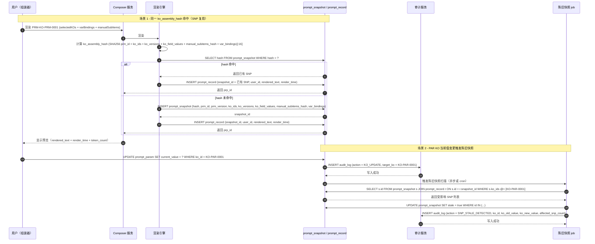

<!-- prd:section=document-meta -->
# 辽港伐谋知识管理平台 产品需求文档（v0.32 精炼版）

> **文档编号**：PRD-2026-001-v0.32
> **状态**：v0.32 精炼（17 OQ 全部 grill 闭合）— 当前为 checkpoint-prd 状态，待 Phase 4 finalize 升级
> **来源**：PRD v0.31（2026-07-10）+ HTML 原型 V3.0 + 17 项 owner 决议（2026-07-13）
> **精炼方式**：spec-prd 流程（PRD Sanitization + Requirement Analysis Gate + Product Expert Lens + Requirements Grill 17 问 + Pre-Write Closure Gate）

---

## 文档信息

| 字段 | 内容 |
|------|------|
| 文档标题 | 辽港伐谋知识管理平台 需求文档 v0.32 精炼版 |
| 产品版本 | v1.0（MVP 阶段，5-8 内部用户） |
| 作者 | 产品团队 + spec-prd 精炼流程（`spec-prd` workflow） |
| 创建日期 | 2026-05-28 |
| 精炼日期 | 2026-07-13 |
| 评审日期 | 待定 |
| 上线日期 | 待定 |
| 关联需求 | 辽港伐谋知识管理平台_原型_V3.html（V3.0 基准） |

---

## 导航（模块地图 + ID 格式速查）

> 本节是 PRD 阅读辅助，按 spec-doc-review F-001/F-006 推荐添加。模块地图帮助快速定位章节；ID 格式速查作为实施期快速参考。

### 模块地图

PRD 共 10 个一级章节 + 5 个尾部章节（Owner Decision Trace / Outstanding Questions / Planning Recheck / Readiness Self-Check / Sources & References）。按阅读优先级排序：

| # | 章节 | 核心内容 | 何时读 |
|---|------|----------|--------|
| 1 | 一、问题陈述 | 6 大痛点（OQ-18 修订） | 第一次阅读 / 战略对齐 |
| 2 | 二、目标 | 6 个目标（OQ-18 参数化） | 第一次阅读 / 战略对齐 |
| 3 | 三、非目标 | 9 项非目标（OQ-2/14 追加） | 第一次阅读 / 边界判断 |
| 4 | 四、用户故事 | 21 个 US（5 角色 × 4 个角色段） | 实施 / 验收 |
| 5 | 五、需求详细说明 | 50+ FR / 11 节 5.2 横向约束 / 29 NFR | 实施 / 验收 / spec-plan |
| 6 | 六、成功指标 | 3 阶段 × 9 指标（OQ-18 参数化） | 灰度 / 全量评估 |
| 7 | 七、开放问题 | 7 项已解决 + 0 待办 | 维护 |
| 8 | 八、时间计划 | 4 个 Sprint + 灰度/全量 | 排期 |
| 9 | 九、依赖与风险 | 6 项依赖 + 5 项风险 | 排期 / 风险评估 |
| 10 | 十、附录 | 术语表 / 原型 / ID 规则 / 修订对照 | 实施参考 |
| 尾 1 | Owner Decision Trace | 20 条 OQ 决议 | 决策追溯 |
| 尾 2 | Outstanding Questions | 4 项 how-pushdown | 实施启动前 |
| 尾 3 | Planning Recheck | 8 项复核点 | spec-plan / spec-work |
| 尾 4 | Readiness Self-Check | 流程闭合报告 | Phase 4 |

### ID 格式速查（§10.7.7 完整版）

| 对象 | 格式 | 示例 | 自增粒度 |
|------|------|------|----------|
| 知识对象 KO | `KO-{TYPE}-{NNNN}` | `KO-CON-0015` | 按 TYPE 独立 |
| 项目 PROJ | `PROJ-{NNNN}` | `PROJ-0001` | 全局自增 |
| 提示词记录 PRP | `PRP-{NNNN}` | `PRP-0001` | 全局自增 |
| 快照 SNP | `SNP-{YYYYMMDD}-{HHMM}` | `SNP-20260521-1430` | 时间戳 + 同分钟追加 `-X` |
| KO 版本 | `v{MAJOR}.{MINOR}.{PATCH}` | `v3.1.0` | 语义化（手动/自动） |
| 角色 ROLE | `ROLE-{NNNN}` | `ROLE-0001` | 0001~0004 预置 / 0005+ 自定义 |
| 用户 USR | `USR-{NNNN}` | `USR-0001` | 全局自增 |
| 审计日志 AUDIT | `AUDIT-{YYYYMMDD}-{NNNNNN}` | `AUDIT-20260605-000001` | 按天独立 |
| 字典项 DICT | `DICT-{CATEGORY}-{CODE}` | `DICT-FORCE-Hard` | 手动指定 |
| 类型分组 GRP | `GRP-{TYPE}-{NNNN}` | `GRP-CON-0001` | 按 TYPE 独立 |
| 冲突记录 CT | `CT-{TYPE}-{YYYYMMDD}-{NNNN}` | `CT-C1-20260605-0001` | 按 TYPE+日期独立 |
| 量纲 DIM | `DIM-{NNNN}` | `DIM-0001` | 全局自增 |

---

<!-- prd:section=summary -->
## v0.32 精炼摘要（17 项决议）

> 本节是 v0.31 → v0.32 的关键变更概览。详细决策见末尾 `## Owner Decision Trace`。

| 编号 | 决议 | 影响范围 |
|------|------|----------|
| OQ-1 | 项目仅做数据隔离（v0.37 维持） | §1 痛点#6、§4 US-15~17、§5.2.2 |
| OQ-2 | 删除业务专家「提案权」功能 | §4 US-11/12、§5.2.2.1 整段删除、FR-41/42 删除、§6 业务专家活跃度删除 |
| OQ-3 | 改为补 seed 达到 header == list 一致 | §5.2.10 chip 方案删除、NFR-20 改为差异=0、§10.4 部署门禁 |
| OQ-4 | 跨类搜索按原型实现（source-resolved） | FR-05 验收补 title+id+typeName 3 字段 |
| OQ-5 | 3 秒撤销仅前端，删除后端接口 | §5.2.6 接口契约、audit_log 模型、§5.2.6 表格 |
| OQ-6 | PRM 走标准 KO Version 流程 | §5.2.1.4 PRM 豁免表重写 |
| OQ-7 | 项目归档仅 KO 冻结，PRP/SNP 不动 | FR-34、§5.2.2 关键规则 4 |
| OQ-8 | 管理员仲裁快路径（自动全流程） | §5.2.1 状态机新增快路径、FR-23 验收 |
| OQ-9 | 新增 LLM 冲突建议接口 | §5.2.3、FR-21/22/23、新增 NFR-28 |
| OQ-10 | 删除"检测器版本"相关需求 | §5.2.3、§5.2.8、原型 conflicts page |
| OQ-11 | 审计日志 ID 三重暴露（hover + 详情 + CSV） | FR-26 验收、新增 NFR-29 |
| OQ-12 | 角色变更下次登录生效（撤销 v0.34 修订） | US-18 验收、§5.2.2 关键规则 1、删除 WebSocket 推送 |
| OQ-13 | 联动 OQ-2 关闭（业务专家活跃度） | §6 成功指标 |
| OQ-14 | 提示词-算法结果关联率移入二期 | §6 成功指标、§5.2.8 RoadMap 新增 R-10 |
| OQ-15 | 模板引擎描述收缩到产品需求范围 | §5.2.4、§10.5、FR-15 |
| OQ-16 | 113 KO 改为 PRP 动态实际数 | §10.5、§10.5.1、§10.5.2、§10.5.4 |
| OQ-17 | 联动 OQ-4 关闭（搜索字段） | FR-05 验收 |

---

<!-- prd:section=problem-statement -->
## 一、问题陈述

> 辽港伐谋项目致力于港口运筹优化算法的研发与应用。核心工作流程为：业务专家与算法工程师将港口运筹文档中的知识编码为约束、规则、参数等结构化要素，再将要素装配成提示词，输入伐谋大模型以生成优化方案。

> 目前团队面临以下痛点（OQ-18 修订：所有"约 X 个"等源组织估算已删除，结构性数字与 seed 数据加标签保留）：
>
> 1. **知识散落不可追溯**：港口运筹知识分散在不同来源（PDF、Word、Excel 等）的文档中，缺乏统一的结构化存储与检索机制。
>
> 2. **知识冲突不可见**：当不同来源的知识对象存在值冲突、作用域重叠、语义矛盾时，缺乏自动检测与治理机制，可能直接影响伐谋大模型输出的正确性。
>
> 3. **提示词装配效率低下**：从知识对象到最终提示词，依赖人工复制粘贴与手动校对，每次提示词版本迭代平均耗时较长（OQ-18 修订：移除具体耗时数字，效率问题定性描述）。
>
> 4. **版本变更缺乏追溯**：知识对象的数值变更（如参数调优）缺乏与提示词版本的关联追溯，算法输出结果无法回溯到具体的提示词装配方案。
>
> 5. **知识对象缺乏生命周期管理**：从创建、审核、发布、使用到废弃缺乏标准化工作流。**v0.32 初始 seed 仅供 MVP 阶段参考（详见 §10.4），平台上线后的实际 KO 数量与状态分布由用户与业务增长决定**。
>
> 6. **知识资产缺乏项目级隔离**（OQ-1 决议）：项目仅做数据隔离，无项目内成员/角色表（v0.37 维持）。
>
> 如果不解决，将导致算法提示词质量不可控、团队协作效率持续低下、知识资产无法复用，最终影响伐谋大模型的优化方案质量与港口运营决策的可靠性。

---

<!-- prd:section=goals -->
## 二、目标

| 目标编号 | 目标描述 | 衡量指标 | 目标值 | 衡量时间 |
|----------|----------|----------|--------|----------|
| G-01 | 建立统一知识对象库 | 平台可管理的知识对象总数 | **参数化**：支持 N 个 KO（N 为平台可配置上限，无固定数值约束） | 上线后 30 天 |
| G-02 | 提升提示词装配效率 | 单次提示词装配耗时下降幅度 | **参数化**：相比基线下降 X%（X 为可配置目标） | 上线后 14 天 |
| G-03 | 实现知识冲突的自动检测与治理 | 未处置治理项数量 | **参数化**：≤ K% × 当前 KO 总数（K 为可配置比例阈值） | 上线后 30 天 |
| G-04 | 建立提示词装配方案全生命周期追溯能力 | 版本快照覆盖率 | 100%（每次提示词渲染发布均自动创建快照） | 上线后 7 天 |
| G-05 | 提升知识对象生效率 | 已生效KO（Active 状态）占比 | **参数化**：≥ T%（T 为可配置占比阈值） | 上线后 30 天 |
| G-06 | 建立项目级知识资产隔离 | 平台支持的最大项目数 | **参数化**：支持 P 个项目（P 为可配置上限） | 上线后 14 天 |

> **OQ-18 修订说明**：v0.32 之前 PRD 中"G-01 ≥ 278"、"G-03 ≤ 3（从 13 下降）"、"G-05 ≥ 86%"等目标值均锚定 v0.32 初始 seed 数字（详见 §10.4），已参数化为 N / K% / T% / P 等可配置变量。未来部署时由产品 + 算法团队协商具体值。

---

<!-- prd:section=non-goals -->
## 三、非目标

| 非目标 | 排除原因 |
|--------|----------|
| 伐谋大模型本身的训练与优化 | 属于算法团队职责 |
| 港口实时数据采集与ETL管道 | 需独立立项 |
| 移动端App | MVP阶段仅提供桌面Web端 |
| 外部系统集成（ERP、TOS等） | 接口标准待确认 |
| AI自动生成知识对象 | 技术复杂度高 |
| 多港口实例（多租户） | 仅支持辽港单一实例 |
| 跨项目知识共享与继承 | 首期项目间 KO 完全隔离 |
| 业务专家对 KO 的「提案权」 | v0.32 OQ-2 删除该功能 |
| 提示词-算法结果关联率（trace 头对接）| v0.32 OQ-14 移入二期 |

---

<!-- prd:section=user-stories -->
## 四、用户故事

### 4.1 用户角色与默认权限矩阵（v0.32 OQ-2 + OQ-20 重构）

> **设计意图（OQ-20）**：5 预置系统角色（ROLE-0001~0005）有**预定义默认权限矩阵**（v0.32 初始 seed）；**管理员可在"权限与角色"页面手工调整**任意角色（预置或自定义）的权限矩阵（FR-27 验收 #3 + US-17 验收 #3）；**支持新增自定义角色**（US-17 验收 #2）并配置其完整权限矩阵。

#### 4.1.1 5 预置系统角色（ROLE-0001 ~ ROLE-0005）

| 角色代码 | 角色名称 | 角色定位 | 默认权限范围（v0.32 初始 seed，可由管理员调整）|
|----------|----------|----------|------------------------------------------|
| **ROLE-0001** | 系统管理员 | 平台负责人 | **全权限**：所有菜单所有操作 ✓ |
| **ROLE-0002** | 合规审核员 | 制度审核岗 | **全查阅 + KO 审核**：所有菜单查阅 ✓；知识对象库 KO 审核（Review 状态 KO Version 通过/驳回）✓；不直接编辑 KO |
| **ROLE-0003** | 算法工程师 | 算法开发岗 | **全查阅 + KO 新增/更新**：所有菜单查阅 ✓；知识对象库 6 种 KO 类型新增/更新 ✓；不删除/不审核 |
| **ROLE-0004** | 业务专家 | 业务操作岗 | **全查阅 + 部分编辑**：所有菜单查阅 ✓；知识对象库 RUL/PAR 新增/更新 ✓；CON/SCH/PRM/DOC 仅查阅 |
| **ROLE-0005** | 只读观察者 | 观察/审计岗 | **仅查阅**：所有菜单仅查阅 ✓，无任何新增/更新/删除/审核权 |

> 5 角色 ID 格式 `ROLE-{NNNN}`（0001~0005 为系统预置角色），详见 §10.7.7.6。

#### 4.1.2 默认权限矩阵 - 知识对象库 KO 子类型（v0.32 初始 seed）

按 5 角色 × 6 KO 类型 × 5 操作（查阅/新增/更新/删除/审核）维度展开。**此为初始 seed，管理员可通过 FR-27 权限矩阵 UI 调整**。

**ROLE-0001 系统管理员**：

| KO 类型 | 查阅 | 新增 | 更新 | 删除 | 审核 |
|---------|------|------|------|------|------|
| CON 约束 | ✓ | ✓ | ✓ | ✓ | ✓ |
| RUL 规则 | ✓ | ✓ | ✓ | ✓ | ✓ |
| PAR 参数 | ✓ | ✓ | ✓ | ✓ | ✓ |
| SCH 数据结构 | ✓ | ✓ | ✓ | ✓ | ✓ |
| PRM 提示词模板 | ✓ | ✓ | ✓ | ✓ | ✓ |
| DOC 文档 | ✓ | ✓ | ✓ | ✓ | ✓ |

**ROLE-0002 合规审核员**：

| KO 类型 | 查阅 | 新增 | 更新 | 删除 | 审核 |
|---------|------|------|------|------|------|
| CON 约束 | ✓ | ✗ | ✗ | ✗ | ✓ |
| RUL 规则 | ✓ | ✗ | ✗ | ✗ | ✓ |
| PAR 参数 | ✓ | ✗ | ✗ | ✗ | ✓ |
| SCH 数据结构 | ✓ | ✗ | ✗ | ✗ | ✓ |
| PRM 提示词模板 | ✓ | ✗ | ✗ | ✗ | ✓ |
| DOC 文档 | ✓ | ✗ | ✗ | ✗ | ✓ |

**ROLE-0003 算法工程师**：

| KO 类型 | 查阅 | 新增 | 更新 | 删除 | 审核 |
|---------|------|------|------|------|------|
| CON 约束 | ✓ | ✓ | ✓ | ✗ | ✗ |
| RUL 规则 | ✓ | ✓ | ✓ | ✗ | ✗ |
| PAR 参数 | ✓ | ✓ | ✓ | ✗ | ✗ |
| SCH 数据结构 | ✓ | ✓ | ✓ | ✗ | ✗ |
| PRM 提示词模板 | ✓ | ✓ | ✓ | ✗ | ✗ |
| DOC 文档 | ✓ | ✓ | ✓ | ✗ | ✗ |

**ROLE-0004 业务专家**（OQ-2 修订：仅 RUL/PAR 可编辑）：

| KO 类型 | 查阅 | 新增 | 更新 | 删除 | 审核 |
|---------|------|------|------|------|------|
| CON 约束 | ✓ | ✗ | ✗ | ✗ | ✗ |
| RUL 规则 | ✓ | ✓ | ✓ | ✗ | ✗ |
| PAR 参数 | ✓ | ✓ | ✓ | ✗ | ✗ |
| SCH 数据结构 | ✓ | ✗ | ✗ | ✗ | ✗ |
| PRM 提示词模板 | ✓ | ✗ | ✗ | ✗ | ✗ |
| DOC 文档 | ✓ | ✗ | ✗ | ✗ | ✗ |

**ROLE-0005 只读观察者**：

| KO 类型 | 查阅 | 新增 | 更新 | 删除 | 审核 |
|---------|------|------|------|------|------|
| 全部 6 种 KO 类型 | ✓ | ✗ | ✗ | ✗ | ✗ |

#### 4.1.3 其他菜单默认权限（v0.32 初始 seed）

| 菜单项 | 系统管理员 | 合规审核员 | 算法工程师 | 业务专家 | 只读观察者 |
|--------|------------|------------|------------|----------|--------------|
| 总览 | 查阅 | 查阅 | 查阅 | 查阅 | 查阅 |
| 知识对象库 KO 列表页 | 查阅 | 查阅 | 查阅 | 查阅 | 查阅 |
| 提示词（列表/组装器/快照） | 查阅+新增+更新+删除 | 查阅 | 查阅+新增+更新 | 查阅 | 查阅 |
| 知识治理 | 查阅+LLM 扫描+批量处置+仲裁+导出 | 查阅+审核 KO | 查阅 | 查阅 | 查阅 |
| 审计日志 | 查阅+导出 | 查阅+导出 | 查阅+导出 | 查阅+导出 | 查阅+导出 |
| 项目管理 | 查阅+新增+更新+删除+归档 | 查阅 | 查阅 | 查阅 | 查阅 |
| 字典管理 | 查阅+新增+更新+删除 | 查阅 | 查阅 | 查阅 | 查阅 |
| 权限与角色 | 查阅+新增+更新+删除 | 查阅 | 查阅 | 查阅 | 查阅 |

#### 4.1.4 权限可调整性（关键设计意图）

- **5 预置角色默认权限矩阵**见 §4.1.2 + §4.1.3（v0.32 初始 seed）
- **管理员可在"权限与角色"页面手工调整**任意角色（预置或自定义）的权限矩阵
  - 权限矩阵按 菜单项 × 操作（5 列：查阅/新增/更新/删除/审核）维度组织
  - 知识对象库菜单下含 6 种 KO 子类型缩进子行
  - 管理员通过勾选授权
- **预置角色不可删除**（US-17 验收 #5），但其默认权限可调整
- **支持新增自定义角色**（US-17 验收 #2）并配置其完整权限矩阵
- 角色变更在用户**下次登录时生效**（OQ-12 决议：基于登录态的权限缓存，session 内不变）

#### 4.1.5 权限查找指南（v0.32 PRD F-005 推荐添加）

> 5 角色 × 13 菜单项 × 5 操作共 325 cells，分散在 §4.1.2 + §4.1.3 + §4.1.4 三处。reader 查找"某角色在某菜单的权限"或"某菜单对哪些角色可新增"时按以下三种维度快速定位：

| 查找目标 | 优先查 | 备用查 |
|----------|--------|--------|
| "某角色能做什么"（如系统管理员） | §4.1.1 角色清单（默认范围描述） → §4.1.2/4.1.3 详细矩阵 | 总结在 §4.1.4 末尾的"角色 × 范围"概要 |
| "某菜单对哪些角色可操作"（如 KO 库-CON 新增） | §4.1.2 默认权限矩阵（5 角色独立 6×5 表，CON 行跨列） | §4.1.3 其他菜单默认权限 |
| "某操作可由哪些角色执行"（如删除） | §4.1.2 删除列 × 5 角色 + §4.1.3 其他菜单 | §5.2.2 默认权限矩阵文字描述 |
| "某 KO 类型的全权限视图" | §4.1.2 中 6 个独立表（按 KO 类型列查找） | §10.4 KO 统计 |
| "5 角色整体差异" | §4.1.1 角色清单（5 行 × 4 列对比） | §5.2.2 §5.2.2 关键规则 1-3 |

> **实施参考**：U5（5 预置角色默认矩阵 + 角色 CRUD + 权限矩阵 UI）模块对应本指南；FR-27 角色创建 / 编辑 / 删除；FR-28 用户角色分配。

### 4.2 用户角色与故事（v0.32 18 项决议应用修订）

> 详细 US-01 ~ US-21 验收标准（按 v0.32 + OQ-18 决议应用修改，OQ-1~OQ-18 全部已应用）：
> ~~US-16（项目成员管理）~~ v0.37 删除。

#### 4.2.1 用户角色：知识库管理员（如 FAN）

**【P0 - 必须】**

- **US-01**：作为知识库管理员，我希望在总览仪表盘中查看知识对象的全局统计数据，以便快速掌握知识资产的整体健康状态
  - **验收标准**：
    1. 总览页展示 3 个统计卡片：知识对象总数、已生效 KO、待处置治理项
    2. 每个卡片显示数值、变化趋势（↑/↓）、分类明细
    3. 数据每 5 分钟自动刷新
    4. 页面加载后 3 秒内显示统计数据
    5. **OQ-18 修订**：卡片显示的数字来自后端 `/api/ko/count` 接口实时计算，不限定具体值（v0.32 初始 seed 数字仅作历史快照参考）

- **US-02**：作为知识库管理员，我希望查看最近 10 条知识对象活动动态，以便追踪团队协作进展
  - **验收标准**：
    1. 活动列表显示最近 10 条 KO 的创建、修改、发布、审核操作
    2. 每条活动显示操作人、操作对象 ID、操作描述、时间戳
    3. 活动按类型用不同颜色圆点标记（约束=红色圆点、规则=橙色、参数=绿色）
    4. 支持查看最近 10 条活动记录

- **US-03**：作为知识库管理员，我希望按六种类型（CON/RUL/PAR/SCH/PRM/DOC）浏览和筛选知识对象，以便快速定位特定类型的知识；对于文档类知识对象，我希望点击文档名即可预览 PDF/TXT/Word 格式的文档内容
  - **验收标准**：
    1. 知识对象库支持按类型分类导航（左侧 6 个子菜单项）
    2. 每种类型页面显示：类型介绍卡、KO 列表表格
    3. KO 列表支持按标题搜索、按效力/权威/状态筛选
    4. KO 列表支持分页（采用平台统一分页规范：右对齐布局，含总条数、每页条数选择 10/20/50/100 条/页默认 10、跳转至 X 页+GO 按钮）
    5. **OQ-18 修订**：显示各类型 KO 数量统计（v0.32 初始 seed 示例：CON 19 / RUL 47 / PAR 92 / SCH 41 / PRM 3 / DOC 76，加和 = 278；具体值来自后端接口）
    6. KO 列表为空时显示空状态插图和"暂无知识对象"引导提示
    7. 文档类（DOC）列表页中文档名为可点击链接，点击弹出预览弹窗（900px 宽），PDF 使用 iframe 内嵌预览、TXT 使用等宽文本展示、DOCX 使用 Google Docs Viewer 在线预览、其他格式提示暂不支持

- **US-04**：作为知识库管理员，我希望查看单个知识对象的完整详情，包括形式化定义、作用域、关键参数引用、版本信息和引用关系，以便全面理解该知识对象
  - **验收标准**：
    1. 详情页展示字段网格（元数据）、形式化定义块、作用域可视化、上下游引用列表
    2. 约束类展示数学公式和参数引用链接
    3. 数据结构类展示 Schema 表结构和字段定义
    4. 提示词模板类展示模板源码与渲染预览
    5. 文档类展示元数据

**【P1 - 重要】**

- **US-05**：作为知识库管理员，我希望通过「提示词」列表页进入提示词组装器，按 PRM 模板自定义 Section 结构装配提示词，并实时预览渲染结果，以便高效生成发送给伐谋大模型的最终提示词
  - **验收标准**：
    1. 组装器采用「顶部 PRM 模板选择栏 + 中栏 Section 编排 + 右栏实时预览」布局：顶部 PRM 模板下拉（必选，显示模板名/ID/章节数/必填完成进度），中栏按模板动态加载 Section 列表卡片，右栏实时预览
    2. 中栏各 Section 卡片按 PRM 模板的 Section 数量与顺序展示，含 §N 编号、类型标签 FIXED/DYNAMIC，FIXED 段支持「变量赋值区」绑定参数类 KO，DYNAMIC 段支持从 KO 库选择 KO 或录入手动子项；KO 装配在 Section 卡片内完成
    3. 点击"渲染提示词"按钮时，触发扫描已选 KO 的冲突和健康问题，预检面板显示扫描结果（**OQ-9 修订**：扫描调用 LLM 建议接口 `POST /api/conflict/{id}/suggest`，返回建议 + 置信度 + 理由）
    4. 右栏实时渲染提示词文本，显示字符数、估计 Token 数、渲染耗时
    5. 支持导出为 .txt 文件
    6. 扫描发现未处置冲突时，预检面板展示问题清单并提供处置入口；处置完成后或选择"忽略所有，强制渲染"后方可完成渲染（**OQ-8 修订**：管理员点击"忽略所有"后"仲裁并发布"为快路径，自动 Draft → Review → Approved → Published 一气呵成）

- **US-06**：作为知识库管理员，我希望平台自动检测知识对象之间的冲突（值冲突、作用域重叠、依赖断裂、效力冲突、语义冲突）和自身体健康问题（孤儿引用），以便及时治理
  - **验收标准**（同步至原型 V3 实际支持的类型）：
    1. 治理页面按 **C 类（对象间冲突，本期实现 5 种）** 和 **H 类（自身健康，本期实现 1 种）** 分组展示
       - **C 类本期实现**：C1 值冲突、C2 作用域重叠、C3 依赖断裂、C4 效力冲突、C6 语义冲突
       - **C 类二期 RoadMap**：C5 时序冲突（占位卡片，0 个预留）
       - **H 类本期实现**：H2 孤儿引用
       - **H 类二期 RoadMap**：H1 数据漂移、H3 长期停滞、H4 引用失效、H5 领域空白、H6 扩展项
    2. 每种**本期实现**的冲突类型显示统计卡片；二期 RoadMap 类型显示虚线占位卡片
    3. 冲突详情行展示双方 KO 对比、冲突描述、**OQ-9 修订**：LLM 主动建议（建议 + 置信度 + 理由）、处置下拉选项
    4. **OQ-8 修订**：支持"仲裁并发布"操作（管理员快路径：创建 KO Version → 系统自动 Review → 自动 Approved → 自动 Published；C6 置信度 <0.8 时弹 Modal 二次确认）
    5. KO 列表行上内联显示冲突徽标（高/中/低），点击展开冲突卡片
    6. 已处置项自动从待治理列表移除

- **US-07**：作为知识库管理员，我希望通过「提示词」列表页进入版本与快照页面，查看提示词版本快照历史，包括 MAJOR/MINOR/PATCH 变更记录，以便追溯每次提示词装配方案的变更内容
  - **验收标准**：
    1. 版本快照页以时间线方式展示版本历史
    2. 每个版本节点显示版本号、快照 ID、日期、作者、变更摘要
    3. 变更列表用 [+]/[~]/[-] 标记本次提示词装配方案中新增/修改/删除的 KO
    4. MAJOR/MINOR/PATCH 用不同颜色圆点区分
    5. 当前活跃快照在顶部栏面包屑中显示
    6. **OQ-16 修订**：SNP 反映"装配方案版本"；PRP 反映"渲染动作"（每次渲染均创建 PRP，SNP 复用基于 ko_assembly_hash）

- **US-08**：作为知识库管理员，我希望对知识对象进行创建、编辑、审核、发布、废弃等全生命周期操作，以便管控知识质量
  - **验收标准**：
    1. 每个 KO 具有状态标签：Active / Draft / Review / Deprecated
    2. 支持从"新建知识对象"按钮创建 KO
    3. 编辑操作触发版本号递增（PATCH / MINOR / MAJOR 取决于变更程度）
    4. 审核流程：业务专家修改 → 合规审核员**单次审核**（v0.38 修订：删除 AB 岗） → 管理员发布
    5. 废弃 KO 保留历史但标记状态
    6. **OQ-6 修订**：PRM 编辑走标准 KO Version 流程（Draft → Review → Approved → Published），编辑会替换原 Active 版本

**【P2 - 期望】**

- **US-21**：作为知识库管理员，我希望通过 Excel/CSV 文件批量导入知识对象，并下载各类型的导入模版，以便快速将散落在文档中的知识批量录入平台
  - **验收标准**：
    1. **四种类型子页面（CON/RUL/PAR/SCH）**标题栏均提供"导入"按钮和"下载导入模版"按钮；**PRM（提示词模板）类型不提供批量导入和模版下载**（PRM 结构复杂、含 Section 列表/Markdown 正文/变量定义等多层嵌套，不适用于平面 Excel/CSV 导入）；DOC 类型同样不适用
    2. 点击"导入"弹出导入弹窗，支持上传 .xlsx / .csv 文件，含拖拽上传区域
    3. 上传后显示预览表格（前 5 行），用户确认字段映射后点击"确认导入"
    4. 导入成功后列表自动刷新，导入记录进入审计日志
    5. 点击"下载导入模版"下载对应类型的 Excel 模版文件
    6. 导入失败时显示错误详情（行号、字段名、错误原因），支持部分成功导入

#### 4.2.2 用户角色：业务专家（如码头计划员A）

> **OQ-2 修订**：业务专家仅可对 RUL/PAR 进行新增/更新（其他类型仅查阅）。无提案权。

**【P0 - 必须】**

- **US-10**：作为业务专家，我希望修订参数的当前值并提交审核，以便将码头实际操作经验反馈到算法知识库中
  - **验收标准**：
    1. 参数详情页支持编辑当前值（PAR 类型业务专家有直接编辑权）
    2. 修改后显示新旧值对比
    3. 修改提交后 KO 状态变为"待审核"，出现在"待审核"Tab 中，"我创建的"Tab 也同步显示该参数
    4. 活动列表中记录此次修改
    5. "待审核"Tab 列表显示发起人信息（参数修订人）
    6. 审核员可查看待审核参数列表，支持"通过"或"驳回"操作

- **US-11**：作为业务专家，我希望能将码头反馈信息转化为**规则型**知识对象，以便将一线经验结构化沉淀
  - **验收标准**：
    1. **OQ-2 修订**：业务专家仅可对 RUL 类型直接创建；CON / SCH / DOC 仅查阅无编辑权
    2. 规则型 KO 包含 If-Then 条件格式
    3. 规则支持子规则嵌套和优先级排序

#### 4.2.3 用户角色：算法工程师（如黄泽文）

**【P0 - 必须】**

- **US-12**：作为算法工程师，我希望创建和管理提示词模板（PRM），自定义 Section 结构和变量槽位，以便规范提示词装配流程
  - **验收标准**：
    1. 提示词模板由若干自定义 Section 组成，Section 数量与顺序由模板作者决定（典型 3-15 段），不再限定为固定段数
    2. 每个 Section 独立配置类型：FIXED（固定描述文本，使用 `{{variable}}` 槽位）或 DYNAMIC（基于运行时动态数据列表的渲染骨架，使用 Markdown + Handlebars 子集语法 `{{var}}`、`{{#each items}}`、`{{#if}}`）
    3. 模板渲染时变量自动替换为已选 KO 的值
    4. 渲染结果显示来源追溯行（如"KO-SCH-0101 v2.0.0"）
    5. **OQ-18 修订**：PRP 装配 KO 数为动态实际数（v0.32 初始 seed 示例 KO-PRM-0001 PRP-0001 = M 个）

- **US-13**：作为算法工程师，我希望在发布新版本约束或规则时，系统自动检测其与现有知识对象的冲突，以便在影响算法之前预先处置
  - **验收标准**：
    1. 新增/修改 KO 时自动触发写时检测
    2. 预检面板在点击"渲染提示词"时扫描所有已选 KO
    3. 运行时压制在生产环境算法调用时生效
    4. **v0.32 修订**：删除原"三级防线覆盖"措辞（v0.31 v0.36 措辞）

#### 4.2.4 用户角色：合规审核员

**【P1 - 重要】**

- **US-14**：作为合规审核员，我希望审核约束型 KO 是否符合集团制度规范，并有权驳回不符合规范的修改提案
  - **验收标准**：
    1. 审核员可查看待审核 KO 的完整内容和修改对比
    2. 支持"批准"和"驳回"操作，驳回须填写理由
    3. 驳回记录在活动列表中可见

#### 4.2.5 用户角色：系统管理员（如平台负责人）

> **OQ-1 维持 v0.37**：项目仅做数据隔离，无项目内成员/角色表。

**【P0 - 必须】**

- **US-15**：作为系统管理员，我希望创建和管理项目，以便将不同业务场景的知识资产进行隔离
  - **验收标准**：
    1. 支持创建项目，填写项目名称、描述、所属领域
    2. 项目列表展示所有项目及基本信息（**OQ-1+OQ-18 修订**：名称、KO 数、创建时间、状态；KO 数显示 v0.32 初始 seed 数据，平台可支持 P 个项目）
    3. 支持编辑项目信息
    4. 项目内 KO 完全隔离（按 project_id 过滤），不同项目间 KO 互不可见
    5. **OQ-1 维持 v0.37**：项目切换器显示全部项目列表；项目仅做数据隔离，不设置项目内用户/角色；用户按系统角色访问任意项目
    6. 全局管理员可跨项目查看所有 KO

- ~~**US-16**：作为系统管理员，我希望为项目添加/移除成员并设置角色~~（**v0.37 + v0.32 删除**）
  - 原因：项目仅做数据隔离，无项目内成员/角色。用户按系统角色访问任意项目
  - 替代：项目内 KO 完全隔离由 NFR-11 保证；用户对 KO 的操作权限由系统角色决定（见 §5.2.2）

- **US-17**：作为系统管理员，我希望创建和管理角色，按菜单和操作细粒度授权，以便灵活控制不同用户的功能访问范围
  - **验收标准**：
    1. 角色列表页展示所有已定义角色（角色名称、描述、用户数、创建时间）
    2. 支持创建/编辑角色，填写角色名称、描述
    3. **OQ-2 修订**：角色权限配置采用菜单-操作矩阵，**5 列**（查阅 / 新增 / 更新 / 删除 / 审核，**无"提案"列**——v0.32 删除业务专家提案权）
    4. 支持删除未被任何用户使用的角色
    5. 系统预置角色（算法工程师、业务专家、合规审核员、系统管理员）不可删除

- **US-18（v0.32 OQ-12 修订）**：作为系统管理员，我希望将指定角色分配给指定用户，以便用户获得相应的功能操作权限
  - **验收标准**：
    1. 用户列表页展示所有平台用户（用户名、邮箱、当前角色、最近登录时间）
    2. 支持为用户分配一个或多个角色
    3. 角色分配保存后弹窗静默关闭，**右上角 Toast 反馈**（3 秒，可撤销；**OQ-5 修订**：撤销仅前端 UI 回滚，**不写 USER_ROLE_REVERT 审计**；**OQ-12 修订**：**跨设备撤销不可行**）
    4. **OQ-12 修订**：**角色变更后用户下次登录时生效**（撤销 v0.34 修订"下次操作时生效"）
    5. **OQ-12 修订**：**删除 WebSocket `role-changed` 推送**（无需实时同步）
    6. 审计日志记录 `USER_ROLE_CHANGE`（含 old/new 角色快照、effective_at = 用户下次登录时点、changed_by）
    7. 用户列表支持分页，采用平台统一分页规范

- **US-19**：作为系统管理员，我希望管理平台字典（类型介绍、效力分级、权威分级、类型分组名称、知识对象概念、量纲配置），以便统一维护知识对象的分类体系和业务术语
  - **验收标准**：
    1. 字典管理页面按六类字典组织：类型介绍、效力分级、权威分级、类型分组名称、知识对象概念、量纲配置
    2. 类型介绍：管理六种 KO 类型（CON/RUL/PAR/SCH/PRM/DOC）的名称、代码、定义说明，支持编辑类型描述
    3. 效力分级：管理效力级别（Hard/Soft/Rec/Emp）的名称和说明
    4. 权威分级：管理权威层级（L1~L5）的名称和排序
    5. 类型分组名称：管理各类型下子分组名称，支持新增/编辑/删除分组
    6. 知识对象概念：管理 KO 核心特性和标识规则
    7. 量纲配置：管理参数类 KO 的量纲单位，支持新增/编辑/删除量纲；初始化预制 9 个量纲
    8. 字典变更记录到审计日志

- **US-20**：作为系统管理员，我希望查看审计日志，以便追踪所有知识对象的变更历史和用户操作记录
  - **验收标准**：
    1. 审计日志页面展示所有 KO 变更记录（创建/修改/删除/版本发布/审批/冲突处置）
    2. 每条日志含操作人、操作时间、操作类型、涉及 KO ID、变更前后内容对比
    3. 支持按操作类型、时间范围、操作人筛选
    4. 列表支持分页（采用平台统一分页规范）
    5. 支持导出日志为 CSV 文件
    6. 日志保留周期 ≥ 12 个月，超期日志自动归档
    7. **OQ-11 修订**：审计日志 ID 三重暴露：① hover 行 tooltip 显示完整 AUDIT ID（响应时间 NFR-29 ≤ 100ms）② 点击行打开详情弹窗显示完整记录 ③ CSV 导出首列为 AUDIT ID

---

<!-- prd:section=requirements -->
## 五、需求详细说明

### 5.1 功能需求（FR）

> v0.32 修订：删除 FR-41（业务专家提案权）、FR-42（权限矩阵新增提案列）；新增 LLM 建议相关验收。

#### 模块一：总览仪表盘

| 需求ID | 需求描述 | US | 优先级 | 验收标准 |
|--------|----------|------|--------|----------|
| FR-01 | 统计卡片展示 | US-01 | P0 | 展示 3 个统计卡片：知识对象总数、已生效KO、待处置治理项；**OQ-3 强化**：header 数字与"全部"tab 实际渲染数严格一致（差异 = 0）；**OQ-18 修订**：卡片显示数字来自后端 `/api/ko/count` 接口实时计算，不限定具体数值（v0.32 初始 seed 仅作历史快照）|
| FR-02 | 最近活动列表 | US-02 | P0 | 最近 10 条 KO 操作记录 |

#### 模块二：知识对象库

| 需求ID | 需求描述 | US | 优先级 | 验收标准 |
|--------|----------|------|--------|----------|
| FR-05 | 全景概览首页 | US-03 | P0 | 4 个全库统计卡片 + 6 类型入口大卡片（颜色+形状+类型代码+KO数量）；**OQ-4 跨类搜索**：触发后完全隐藏 libBrowseContent；搜索结果按 6 固定分组（CON→RUL→PAR→SCH→PRM→DOC）；**OQ-4+OQ-17**：搜索匹配字段 = title + id + typeName（3 字段）|
| FR-07 | KO列表表格 | US-03 | P0 | 6 类型页面统一分页；**OQ-3 强化**：header 数字与"全部"tab 严格一致 |
| FR-08 | KO详情展示 | US-04 | P1 | 字段网格+形式化定义+作用域+引用 |
| FR-09 | 冲突内联展示 | US-06 | P1 | 冲突徽标（高/中/低）|
| FR-10 | KO创建与编辑 | US-08,US-10,US-11 | P0 | 6 种类型 KO；**OQ-6 PRM 走标准 KO Version 流程**（v0.32 重写）|
| FR-11 | KO审核与生命周期 | US-08,US-14 | P1 | 状态机 §5.2.1 + 单次审核 |
| FR-36 | KO批量导入 | US-21 | P1 | CON/RUL/PAR/SCH 4 类型子页面有导入按钮；PRM/DOC 不适用 |
| FR-37 | 导入模版下载 | US-21 | P1 | 4 类型子页面有模版下载；PRM/DOC 不适用 |
| FR-38 | 文档预览 | US-03 | P1 | PDF iframe / TXT 等宽 / DOCX Google Docs Viewer / 其他不支持；30 分钟 token |
| FR-39 | 列表 Tab + 筛选布局 | US-03,US-10 | P0 | CON/RUL/PAR/SCH/DOC 5 类统一 Tab+卡片；DOC 不含"待审核"Tab；PRM 不采用此布局 |

#### 模块三：提示词

| 需求ID | 需求描述 | US | 优先级 | 验收标准 |
|--------|----------|------|--------|----------|
| FR-12 | 提示词列表页 | US-05,US-07 | P0 | **OQ-16 修订**：列"上次 PRP 装配 N KO"（PRP 实际数）|
| FR-13 | 组装工作台 | US-05 | P1 | 顶部 PRM + 中栏 Section + 右栏预览 |
| FR-14 | KO选择与编排 | US-05 | P1 | DYNAMIC 段 KO 模式/FIXED 段变量赋值区 |
| FR-15 | 自定义 Section 模式 | US-12 | P0 | PRM 模板由若干自定义 Section 组成，**每个 Section 独立配置类型**：FIXED / DYNAMIC；**OQ-15 修订**：PRM Section 渲染支持 Markdown 元素（H2-H4、粗体/斜体、代码块、表格、列表、引用、链接、分隔线、{{var}} 高亮）+ Handlebars 子集（**产品可观察输出，不描述实现引擎**）；**OQ-16+OQ-18 修订**：每段实际渲染数 = selectedKOs + varBindings + manualSubItems，PRP 装配数 = M（M 为动态实际数，v0.32 初始 seed 示例 KO-PRM-0001 PRP-0001 = 113） |
| FR-16 | 组装预检面板 | US-06,US-13 | P1 | 预检+处置+**OQ-9 LLM 主动建议**（建议+置信度+理由）|
| FR-17 | 实时预览渲染 | US-05,US-12 | P1 | 深色背景代码风格；字符数/Token/渲染耗时 |
| FR-18 | 提示词导出与快照 | US-05,US-07 | P1 | 渲染+快照+导出 .txt；**OQ-16**：PRP 反映"渲染动作" |
| FR-19 | 版本时间线 | US-07 | P1 | 时间线+MAJOR/MINOR/PATCH 颜色 |
| FR-20 | 快照创建与管理 | US-07 | P1 | 快照+**OQ-16**：SNP 反映"装配方案版本" |

#### 模块四：知识治理

| 需求ID | 需求描述 | US | 优先级 | 验收标准 |
|--------|----------|------|--------|----------|
| FR-21 | C类对象间冲突管理 | US-06 | P1 | C1-C6 + C5 预留；**OQ-9 LLM 主动建议**+**OQ-8 仲裁并发布快路径** |
| FR-22 | H类自身健康管理 | US-06 | P1 | H2 孤儿引用本期；H1/H3-H6 二期占位 |
| FR-23 | 治理操作功能 | US-06 | P1 | LLM 全库扫描 + 批量处置 + **OQ-8 仲裁并发布快路径**（自动 Draft→Review→Approved→Published）；审计日志 USER_CONFLICT_ARBITRATE |

#### 模块六：导航与基础框架

| 需求ID | 需求描述 | US | 优先级 | 验收标准 |
|--------|----------|------|--------|----------|
| FR-24 | 左侧导航栏 | US-01,US-03,US-05,US-06,US-07 | P0 | 深色侧栏 3 分组 |
| FR-25 | 顶部栏 | US-01 | P0 | **OQ-12 修订**：删除"WebSocket `role-changed` 事件推送"；简化为"展示当前登录用户的系统角色（不实时同步）"|
| FR-26 | 审计日志 | US-20 | P1 | 6 列（无 ID 列）；**OQ-11 审计 ID 三重暴露**：①hover tooltip ②详情弹窗 ③CSV 导出首列；**OQ-5 修订**：删除 audit_log.reverted_at / reverted_by / status(reverted) 字段 |
| FR-27 | 角色创建与管理 | US-17 | P0 | **OQ-2 修订**：5 列权限矩阵（查阅/新增/更新/删除/审核，**无"提案"列**）|
| FR-28 | 用户角色分配 | US-18 | P0 | 静默关闭+Toast 反馈；**OQ-12 修订**：**角色变更下次登录时生效**（撤销 v0.34 修订"下次操作"）；审计日志 USER_ROLE_CHANGE.effective_at = 用户下次登录时点 |

#### 模块七：项目管理

| 需求ID | 需求描述 | US | 优先级 | 验收标准 |
|--------|----------|------|--------|----------|
| FR-30 | 项目列表页 | US-15 | P0 | **OQ-1 维持 v0.37**：删除"成员数列" |
| FR-31 | 项目创建与编辑 | US-15 | P0 | **OQ-1 维持 v0.37**：创建项目不自动绑定项目管理员 |
| FR-33 | 项目级知识对象隔离 | US-15 | P0 | 全部项目列出（v0.37 维持）|
| FR-34 | 项目归档 | US-15 | P1 | **OQ-7 修订**：归档项目**仅 KO 冻结**，**PRP/SNP 不动**（已渲染 PRP 仍可被算法调用，SNP 复用逻辑继续生效）；提示词列表与快照页对归档项目条目显示"项目已归档"状态标签 |
| FR-35 | 量纲配置 | US-19 | P1 | 9 预制量纲 |

### 5.2 状态机与横向约束

<!-- prd:section=state-machine -->

#### 5.2.1 KO 状态机（v0.32 重构）

##### 5.2.1.1 双层状态定义（同 v0.31）

L1：KO 主体状态（Active / Deprecated / Pending）；L2：KO 工作版本状态（Draft / Review / Approved / Rejected / Withdrawn / Published / Discarded）

##### 5.2.1.2 状态转换图（含 OQ-8 管理员仲裁快路径）

```
[KO 主体] Active / Pending / Deprecated
[KO 工作版本] Draft → Review → Approved → Published（标准流程）
[管理员仲裁快路径（OQ-8）] Draft → 系统自动 Review → 系统自动 Approved → 系统自动 Published
```

##### 5.2.1.3 角色限制表（v0.32 OQ-8 新增快路径行）

- KO 主体：业务专家/算法工程师创建；系统自动/管理员发布
- KO 工作版本：业务专家/算法工程师编辑；审核员单次审核（v0.38 删 AB 岗）；管理员/系统自动发布
- **管理员仲裁快路径（OQ-8）**：系统管理员点击"仲裁并发布"→ 自动 Draft→Review→Approved→Published；审计日志 USER_CONFLICT_ARBITRATE

##### 5.2.1.4 类型豁免规则（v0.32 OQ-6 重写）

| 类型 | 流程 | 说明 |
|------|------|------|
| **CON / RUL / PAR / SCH / DOC** | 走标准工作版本流程 | CON/RUL/PAR/SCH 完整流程；DOC 上传后直接为 Active（编辑仍需审核）|
| **PRM** | 走标准 KO Version 流程（OQ-6 决议）| **v0.32 修订**：PRM 编辑走标准 KO Version 流程（Draft → Review → Approved → Published），编辑会替换原 Active 版本；Section 结构变更触发 MAJOR 升级；KO-PRM-0001 维持 KO ID 不变，version 可升级为 v3.0.1 / v3.1.0 / v4.0.0 等 |

##### 5.2.1.5 约束规则（同 v0.31 + OQ-8 例外）

- 任何状态转换必须记录审计日志
- 不允许从 Active KO 直接创建新的 Active 版本的 KO
- 审核员不可审核自己提交的 KO Version
- 管理员仲裁快路径（OQ-8）不受"Pending 状态 KO 期间不允许创建新工作版本"约束

<!-- prd:section=role-model -->

#### 5.2.2 系统角色权限模型（v0.32 OQ-1+OQ-2 简化）

> **v0.32 重大修订（OQ-1 维持 v0.37）**：项目仅做数据隔离，**不设置项目内角色 / 成员表**。
>
> **v0.32 重大修订（OQ-2 删除提案权）**：原 §5.2.2.1 业务专家提案权流程**整段删除**；FR-41/FR-42 删除；业务专家对 CON/SCH/DOC 仅查阅。

**关键规则（v0.32 简化）**：

1. **角色生效时机（OQ-12 修订）**：当前在线用户的角色变更在**下次登录**时生效；不需重新登录（常驻）；不通过 WebSocket 实时推送；用户当前会话保持原权限至重新登录；审计日志 USER_ROLE_CHANGE.effective_at = 用户下次登录时点
2. **跨项目审核**：合规审核员可对所有非归档项目的 Review 状态 KO Version 执行通过/驳回
3. **项目数据隔离（NFR-11）**：所有 KO 归属于唯一项目
4. **权限可调整性（OQ-20）**：5 预置角色的默认权限矩阵见 §4.1（v0.32 初始 seed）；管理员可在"权限与角色"页面通过菜单-操作矩阵调整任意角色的权限（FR-27 验收 #3 + US-17 验收 #3）；预置角色不可删除（US-17 验收 #5）但其默认权限可调整；支持新增自定义角色（US-17 验收 #2）并配置其完整权限矩阵

**默认权限矩阵（v0.32 5 列，OQ-2 + OQ-20 修订）**：见 §4.1（含 5 角色 × 6 KO 类型 × 5 操作 完整默认矩阵 + 其他菜单默认权限 + 权限可调整性）

**v0.32 删除的旧内容**：
- ❌ §5.2.2.1 业务专家提案权流程（整段移除）
- ❌ FR-41（业务专家提案权）
- ❌ FR-42（权限矩阵新增提案列）
- ❌ §5.2.2 关键规则 1 中的"WebSocket `role-changed` 事件推送"（OQ-12 决议）

<!-- prd:section=conflict-detection -->

#### 5.2.3 冲突检测算法（v0.32 OQ-9+OQ-10 重构）

> **v0.32 重构要点**（F-014 推荐添加，4 句话）：
> 1. **MD5 冲突指纹算法保留**（§5.2.3.1，§10.7.7 形式不变）— 同一冲突的稳定识别与 ID 复用。
> 2. **LLM 主动建议新增**（§5.2.3.2，OQ-9）— 新增 `POST /api/conflict/{id}/suggest` 接口，AI 建议 = LLM 调用结果（非前端 mock），含建议 + 置信度 + 理由 + 配额管理 + ≤ 5s 响应（NFR-28）。
> 3. **检测器版本号删除**（OQ-10）— 原型 V3 "检测器版本 v2026.07.08" 显示 + `TASK-C6-YYYYMMDD-HHMM` 任务编号移除；版本号概念作为后端实现细节，UI 不展示。
> 4. **冲突类型占位清晰**（§5.2.3 / §5.2.8 / §10.6）— C1-C6 + H1-H6 状态在 PRD 内三处一致（US-06 验收 / 算法实现 / 附录冲突定义）。

##### 5.2.3.1 冲突特征指纹算法（保持不变）

MD5 指纹 + 复用规则（同 v0.31）。

##### 5.2.3.1.1 冲突类型清单（v0.32 PRD F-009 推荐添加）

> 与 US-06 验收 #1 / §10.6 列表交叉引用，reader 一次查全部冲突类型。

| 代码 | 名称 | 描述 | 当前数量（v0.32 初始 seed） |
|------|------|------|---------------------------|
| C1 | 值冲突 | 两个活跃KO对同一参数声明不一致的数值 | 2 |
| C2 | 作用域重叠 | 多个约束在同一作用域内声明不同值 | 6 |
| C3 | 依赖断裂 | KO引用的另一个KO正在进入Deprecated状态 | 1 |
| C4 | 效力冲突 | 关联KO之间的Hard/Soft分类存在矛盾 | 2 |
| C5 | 时序冲突 | 版本时序导致的冲突（二期 R-02 预留）| 0 |
| C6 | 语义冲突 | LLM检测到的自然语言描述层面的语义矛盾 | 1 |
| H1 | 数据漂移 | 参数值已偏离其历史基线来源（二期 R-03 预留）| 0 |
| H2 | 孤儿引用 | KO未被任何提示词或算法引用 | 1 |
| H3-H6 | 未来扩展 | 二期 R-04~R-07 预留 | 0 |

##### 5.2.3.2 LLM 冲突检测与主动建议（v0.32 OQ-9 新增）

> 原 PRD 仅描述"AI 建议"展示但未定义后端实现。v0.32 明确：**AI 建议 = LLM 调用结果**，非前端 mock。

**新增后端接口契约**：

```yaml
POST /api/conflict/{id}/suggest:
  desc: 基于 LLM 的冲突检测接口，返回冲突检测结果及相关处理建议
  req: {}
  resp:
    code: 0
    data:
      suggestion: 'OVERRIDE' | 'COEXIST' | 'SPLIT' | 'DEFER' | 'IGNORE'
      confidence: float  # 0-1
      rationale: str     # LLM 理由说明
      recommended_action: '一键仲裁' | '人工复核'
    err:
      '40301': 权限不足
      '42901': LLM 配额耗尽
      '40801': LLM 调用超时（>5s）

GET /api/conflict/{id}/quota:
  desc: 查询当前用户/全平台 LLM 建议配额余量
  resp:
    code: 0
    data:
      remaining: int
      total: int
```

**行为规范**：
- 每次用户点击"AI 建议"按钮 → 调用 `POST /api/conflict/{id}/suggest` 消耗 1 次 LLM 配额
- LLM 主动提供：① 冲突类型判定（C1-C6/H1-H6）② 处置建议 ③ 置信度（0-1）④ 理由说明
- 配额管理：与 §6 LLM 扫描配额合并（每日 N 次，平台级 + 用户级双重限制）
- C6 置信度 <0.8 时：UI 弹 Modal"LLM 置信度较低，建议人工复核"二次确认
- 响应时间：NFR-28 ≤ 5s（含 LLM 调用）

##### 5.2.3.3 删除项（v0.32 OQ-10 决议）

- ❌ "检测器版本号"概念（v0.31 原型显示 v2026.07.08）—— v0.32 整段删除
- ❌ LLM 扫描任务编号 `TASK-C6-YYYYMMDD-HHMM`
- ❌ §5.2.8 二期 RoadMap 中"检测器版本"相关

<!-- prd:section=snp-prp -->

#### 5.2.4 SNP 与 PRP 关系（v0.32 OQ-16 重构）

**核心原则**（保持不变）：
- SNP 反映"装配方案的版本变化"（模板结构 + KO 引用 + KO 当前值）
- PRP 反映"渲染动作"（用户操作 + 渲染参数 + 触发时间）

**113 KO 口径重定义（OQ-16 决议）**：
- 原 PRD §10.5 "KO-PRM-0001 = 113 KO"是模板 seed 中**典型装配示例**
- v0.32 重定义：**113 = PRP 动态实际数** = selectedKOs + varBindings + manualSubItems（每次渲染时计算）
- PRM 列表"装配 KO 数"列改为"**上次 PRP 装配 N KO**"（显示最后渲染的实际数）
- 删除"PRM 必须由算法团队登记 assembly_ko_count 字段"部署门禁
- MVP 用户首次渲染某 PRM 可少于 113；不强制

**PAR 当前值变更处理**（保持不变）：SNP 标记 stale: true；治理页"陈旧快照"区块；写审计 SNP_STALE_DETECTED。

**接口契约**（保持不变）：POST /api/prompts/render 包含 selectedKOs/varBindings/manualSubItems，返回 snapshot_id/hash/is_new_snapshot/prp_id。

#### 5.2.4.1 SNP/PRP 创建与陈旧快照流程（v0.32 PRD F-003 推荐添加）

> Mermaid 序列图演示完整 SNP/PRP 生命周期：渲染 → hash 命中 → 复用 / 渲染 → hash 未命中 → 创建 SNP+PRP / PAR KO 当前值变更 → 触发陈旧快照 + 审计。



> 实施参考：U6（PRM + Handlebars + 组装器）+ U8（SNP/PRP + 陈旧快照 job）模块对应本流程。

<!-- prd:section=other-constraints -->

#### 5.2.5 字典引用完整性（保持不变）

软删除 / 硬删除 / 级联更新（同 v0.31）。

#### 5.2.6 危险操作与审计（v0.32 OQ-5+OQ-11 重构）

> v0.32 重大修订：3 秒撤销仅前端，删除后端接口契约；审计日志 ID 三重暴露。

**v0.32 重构要点**（F-004 推荐添加，3 句话）：
1. **3 秒撤销仅前端 UI**：所有"删除"类操作 Toast 3 秒可撤销 UI 回滚，**不调后端接口**（已删除 `POST /api/audit/{id}/revert` 40801/40301 错误码 + `revertable/reverted_at/reverted_by` 字段 + `status: committed/reverted` 二态），**不写 `USER_ROLE_REVERT` 审计**，跨设备撤销不可行。
2. **audit_log ID 三重暴露**（OQ-11）：① hover 行 tooltip 显示完整 `AUDIT-YYYYMMDD-NNNNNN`（响应时间 NFR-29 ≤ 100ms）② 点击行打开详情 Modal 展示完整记录 ③ CSV 导出首列含 AUDIT ID。
3. **audit_log 简化模型**：字段为 `id / action / user_id / target_ko / detail / reason / created_at`；**无 reverted_* 字段**；FR-26 验收不再保留"显示已撤销"开关 / status 筛选维度 / ↩️ 图标。

**危险操作表**：

| 操作 | 确认方式 | 审计要求 | undo 窗口 |
|------|----------|----------|-----------|
| 强制渲染提示词 | 必填理由二次确认弹窗（≥10 字符）| 写审计：FORCE_RENDER | 无 |
| 审核驳回 | 必填理由 | 写审计：含 reason | 无 |
| **删除 KO Section 绑定 / 子规则 / 手动子项 / 变量绑定** | Toast "已移除，3 秒内可撤销" | **OQ-5 修订**：仅前端 UI 回滚，**不写审计** | 3 秒（仅前端）|
| 删除字典项 | showConfirm() 弹窗 | 写审计 | 无 |
| 标记 KO 废弃 | 弹窗确认 + 可选理由 | 写审计 | 无 |
| 删除 KO 本身 | 弹窗确认（输入 KO ID 确认）| 写审计 | 无 |
| 角色分配 | 静默关闭 + Toast 反馈 | 写审计（含 old/new/effective_at/changed_by）| **OQ-5+OQ-12 修订**：3 秒可撤销（仅前端 UI），**不写审计 USER_ROLE_REVERT**；effective_at = 用户下次登录时点 |

**OQ-5 修订说明**：所有"删除"类操作写审计，**undo 仅控制前端"是否回滚"**（Toast 按钮 3 秒内可撤销 UI 操作），**不绕过审计**、**不写后端撤销记录**、**不写 USER_ROLE_REVERT 审计**。

**审计日志模型（v0.32 OQ-5 简化）**：

```yaml
audit_log:
  id: AUDIT-YYYYMMDD-NNNNNN
  action: str
  user_id: USR-XXXX
  target_ko: KO-XXX
  detail: object
  reason: str
  created_at: timestamp
  # ❌ OQ-5 删除：status / reverted_at / reverted_by
```

**OQ-5 删除的旧内容**：
- ❌ `POST /api/audit/{id}/revert` 接口契约
- ❌ 错误码 40801（撤销超时）、40301（撤销权限）
- ❌ audit_log 字段：revertable / reverted_at / reverted_by / status
- ❌ 审计日志"显示已撤销"开关 / status 筛选维度 / ↩️ 图标

**FR-26 审计日志 ID 三重暴露（OQ-11 决议）**：
1. **hover 行 tooltip**：mouseover 时弹出 tooltip 显示完整 AUDIT-YYYYMMDD-NNNNNN（响应时间 NFR-29 ≤ 100ms）
2. **详情弹窗**：点击行打开 Modal，展示完整 audit_log 记录
3. **CSV 导出**：导出列含 AUDIT ID（第一列）

#### 5.2.7 KO 三大特性（保持不变，仅保留概念定义）

原子化 / 可寻址 / 可治理（概念性，不强制自动校验）。二期 RoadMap R-01：KO 库 ≥ 500 时引入相似度检测。

<!-- prd:section=roadmap -->

#### 5.2.8 冲突类型占位与二期 Roadmap（v0.32 更新）

**v0.32 RoadMap 清单（OQ-14 新增 R-10）**：

| 序号 | 名称 | 触发条件 | 优先级 |
|------|------|----------|--------|
| R-01 | KO 标题相似度检测 | KO 库 ≥ 500 | 中 |
| R-02 | C5 时序冲突检测 | 用户量增长 | 中 |
| R-03 | H1 数据漂移检测 | PAR 历史基线数据积累 6 个月 | 中 |
| R-04 | H3 长期停滞检测 | KO 库规模 ≥ 500 | 低 |
| R-05 | H4 引用失效检测 | KO 库规模 ≥ 500 | 低 |
| R-06 | H5 领域空白检测 | 业务领域图谱完善 | 低 |
| R-07 | H6 扩展项 | 业务需求扩展 | 低 |
| R-08 | 跨项目知识共享与继承 | 多项目协同场景增多 | 中 |
| R-09 | 多港口实例（多租户）| 业务扩展至其他港口 | 低 |
| **R-10** | **提示词-算法结果关联率**（OQ-14 新增）| 算法团队 trace 头对接就绪 | 中 |

**v0.32 删除的旧 RoadMap 项**：
- ❌"检测器版本号"管理（OQ-10 决议）

<!-- prd:section=dashboard-metric -->

#### 5.2.9 Dashboard 数据口径自洽（保持不变）

修复后口径：总数 278 / Active 239 / Draft 8 / Review 17 / Deprecated 14，闭环 239+8+17+14=278。

<!-- prd:section=pagination -->

#### 5.2.10 列表分页口径（v0.32 OQ-3 重写）

> v0.32 重大修订：选**方案甲**（补 seed 达到 header == list 严格一致）。删除 v0.31 §5.2.10 的"演示态 chip 方案"。

**实施方案**：
1. **MVP seed 强制目标**：
   - PAR 全部 tab 补到 92 条（当前演示 45 条）
   - DOC 补到 76 条（当前演示 7 条）
   - 其他类型（C1=19 / R1=47 / SCH=41 / PRM=3）已与 §10.4 一致
   - 项目 PROJ-0001=121 / 0002=72 / 0003=49 / 0004=36（归档），加和 121+72+49+36=278 闭环

2. **NFR-20 数字一致性验收（v0.32 重写）**：
   - 平台内所有 KO 计数必须来自后端聚合接口
   - **header 数字与"全部"tab 实际渲染数严格一致**（差异 = 0；**不依赖演示态**）
   - 任意页面刷新后数字一致
   - 后端 5s 内同步（写后读）
   - CI 卡控：seed 完整性 + /api/ko/count 与 §10.4 一致性

3. **FR-07 验收补（v0.32 重写）**：
   - 类型页面 header 数字与"全部"tab 实际渲染数必须严格一致
   - 后端 /api/ko/count 必须在 KO 状态变化后 ≤ 5s 内更新
   - 前端不得自行加和计算
   - page-info 严格取自 /api/ko/list.total

4. **删除的旧内容**：
   - ❌ "演示态 chip" 方案（`.demo-tag`）
   - ❌ "演示态允许差异"分支
   - ❌ 任何状态下的"header 与 list 不一致"接受路径

<!-- prd:section=doc-preview -->

#### 5.2.11 文档预览技术架构（保持不变）

v0.31 引入的 PDF.js + LibreOffice headless + 30 分钟 token 等技术选型保留；NFR-24/NFR-26/NFR-27 验收保持。

#### 5.2.12 横向约束快速定位表（v0.32 PRD F-002 推荐添加）

> 11 子节 5.2.1 ~ 5.2.11 覆盖 KO 状态机 / 角色模型 / 冲突检测 / SNP-PRP / 字典引用 / 危险操作 / KO 三大特性 / Roadmap / Dashboard 口径 / 分页口径 / 文档预览。本表作为快速定位参考。

| 子节号 | 标题 | 关键决议（OQ 标记） |
|--------|------|---------------------|
| 5.2.1 | KO 状态机 | 5 状态机 + 类型豁免规则（CON/RUL/PAR/SCH/DOC/PRM，OQ-6） |
| 5.2.2 | 系统角色权限模型 | 5 预置角色 + 默认权限矩阵（OQ-1 维持 v0.37 + OQ-2 删提案权 + OQ-12 下次登录 + OQ-20 §4.1 重构） |
| 5.2.3 | 冲突检测算法 | 6 冲突 + 1 健康检测 + LLM 主动建议（OQ-9 接 DeepSeek v4 + OQ-10 删检测器版本） |
| 5.2.4 | SNP 与 PRP 关系 | 113 KO 装配示例 + ko_assembly_hash 复用 + 模板装配数动态（OQ-15+OQ-16） |
| 5.2.5 | 字典引用完整性 | 软删除 / 硬删除 / 级联更新（v0.31 保留） |
| 5.2.6 | 危险操作与审计 | 3 秒撤销仅前端 + audit_log ID 三重暴露 + 无 reverted_* 字段（OQ-5+OQ-11） |
| 5.2.7 | KO 三大特性 | 原子化 / 可寻址 / 可治理 概念定义 + 二期相似度校验 R-01 |
| 5.2.8 | 冲突类型占位与二期 Roadmap | R-01~R-10（含 OQ-14 新增 R-10 提示词-算法结果关联率） |
| 5.2.9 | Dashboard 数据口径 | 278/239/13 闭环（Active 239 + Draft 8 + Review 17 + Deprecated 14） |
| 5.2.10 | 列表分页口径 | 补 seed 达 header==list 一致（OQ-3 方案甲，OQ-18 不约束具体数字） |
| 5.2.11 | 文档预览技术架构 | PDF.js + LibreOffice headless + 30 分钟 token（NFR-24/26/27） |

### 5.3 非功能需求（NFR）

<!-- prd:section=nfr -->

| 编号 | 类型 | 需求描述 | 衡量标准 |
|------|------|----------|----------|
| NFR-01 | 性能 | 总览仪表盘页面加载时间 | ≤ 2s |
| NFR-02 | 性能 | KO列表页面数据加载 | **参数化（OQ-18）**：列表查询 ≤ g(N) 秒，g(N) 为 SLA 定义的列表查询时间函数（N 为 KO 数量） |
| NFR-03 | 性能 | 提示词组装器实时预览渲染 | **参数化（OQ-18）**：渲染 ≤ h(M) 毫秒，h(M) 为 SLA 定义的渲染时间函数（M 为 PRP 装配 KO 数） |
| NFR-04 | 性能 | 知识冲突检测扫描 | **参数化（OQ-18）**：全库扫描 ≤ f(N) 秒，f(N) 为 SLA 定义的扫描时间函数（N 为 KO 数量） |
| NFR-05 | 性能 | 接口响应时间 | 列表查询/详情查询响应时间由 SLA 函数定义 |
| NFR-06 | 兼容性 | 浏览器支持 | Chrome 90+、Edge 90+、Safari 15+ |
| NFR-07 | 兼容性 | 屏幕分辨率 | 最小支持 1440×900 |
| NFR-08 | 安全性 | 数据传输 | HTTPS 加密 |
| NFR-09 | 安全性 | 用户认证 | 支持SSO/账号密码登录 |
| NFR-10 | 安全性 | **OQ-12 修订**：基于登录态的权限缓存（session 内不变）| 角色变更下次登录生效 |
| NFR-11 | 数据隔离 | 项目间知识对象完全隔离 | KO 按 project_id 过滤 |
| NFR-12~NFR-19 | 可用性/数据/界面/监控 | （同 v0.31）| 同 v0.31 |
| NFR-20 | 界面 | 数字一致性（**OQ-3 重写**）| 差异 = 0（不依赖演示态）|
| NFR-21 | 数据 | 引用关系统计口径 | §10.5.5 口径 |
| NFR-22 | 可访问性 | 类型标识多通道 | 颜色+形状+字母 |
| NFR-23 | 可访问性 | 键盘导航 | Tab/Esc |
| NFR-24/NFR-26/NFR-27 | 文档预览 | PDF.js + 30min token | 同 v0.31 |
| NFR-25 | 安全 | 文件上传校验 | ≤10MB / .xlsx / .csv |
| **NFR-28** | **性能** | **LLM 建议响应（OQ-9 新增）**| `POST /api/conflict/{id}/suggest` ≤ 5s |
| **NFR-29** | **性能** | **审计日志 hover 响应（OQ-11 新增）**| mouseover tooltip ≤ 100ms |

---

<!-- prd:section=success-metrics -->
## 六、成功指标

> v0.32 修订：移除"业务专家活跃度"（OQ-13 联动 OQ-2）；移除"提示词-算法结果关联率"（OQ-14 移入二期 R-10）。

**三阶段 DAU**（OQ-18 修订：DAU 目标参数化）：

| 阶段 | 时间窗 | 平台用户群规模 | DAU 目标 | 渗透率 |
|------|--------|---------------|----------|--------|
| MVP | 上线后 0~4 周 | 小型内部用户群（5-8 人量级） | **参数化**：≥ A 人（A 为产品/业务协商阈值） | ≥ 62% |
| 灰度 | 上线后 5~8 周 | 内部用户群扩展 | **参数化**：≥ B 人（B > A） | ≥ 75% |
| 全量 | 上线后 9 周起 | 业务团队全量 | **参数化**：≥ C 人（C > B） | ≥ 80% |

> **OQ-18 修订说明**：DAU 阶段阈值（A/B/C）锚定 MVP 演示数据，已参数化为可配置变量。

**指标**（v0.32 修订 + OQ-18 修订）：

| 指标类型 | 指标名称 | MVP 目标 | 灰度目标 | 全量目标 |
|----------|----------|----------|----------|----------|
| 领先指标 | 平台 DAU | **参数化**：≥ A 人 | **参数化**：≥ B 人 | **参数化**：≥ C 人 |
| 领先指标 | 算法工程师 DAU 占比 | **参数化**：≥ T1% | **参数化**：≥ T2% | **参数化**：≥ T3% |
| 领先指标 | 业务专家 DAU 占比 | **参数化**：≥ U1% | **参数化**：≥ U2% | **参数化**：≥ U3% |
| 领先指标 | 平台创建的项目数 | **参数化**：≥ P1 个 | **参数化**：≥ P2 个 | **参数化**：≥ P3 个 |
| 领先指标 | 单次提示词装配耗时 | **参数化**：≤ D1 min | **参数化**：≤ D2 min | **参数化**：≤ D3 min |
| 领先指标 | 知识对象月创建数量 | **参数化**：≥ R1 个/月 | **参数化**：≥ R2 个/月 | **参数化**：≥ R3 个/月 |
| 滞后指标 | 未处置治理项数量 | **参数化**：≤ K1% × KO 总数 | **参数化**：≤ K2% × KO 总数 | **参数化**：≤ K3% × KO 总数 |
| 滞后指标 | 知识对象生效率 | **参数化**：≥ V1% | **参数化**：≥ V2% | **参数化**：≥ V3% |
| 滞后指标 | 提示词版本迭代频率 | **参数化**：≥ F1 次/月 | **参数化**：≥ F2 次/月 | **参数化**：≥ F3 次/月 |

> **OQ-18 修订说明**：所有指标已参数化为可配置变量（A/B/C/T/U/P/D/R/K/V/F 等），具体数值由产品 + 业务在部署时协商确定，不锚定 v0.32 初始 seed 数字。

**v0.32 删除项**：
- ❌ "业务专家活跃度（提案数、被采纳数）" —— OQ-13 联动 OQ-2
- ❌ "提示词-算法结果关联率" —— OQ-14 移入二期 R-10

#### v0.32 初始 seed 示例（F-007 推荐添加）

> OQ-18 修订后所有成功指标已参数化为可配置变量（以 A/B/C/T/U/P/D/R/K/V/F 等表达）。reader 看到"目标"时仍需了解"v0.32 初始 seed 数字"作为参考上下文，下表为 MVP 演示态下的示例值（**不约束未来部署**）：

| 指标 | v0.32 初始 seed 示例 | 对应参数化变量 |
|------|----------------------|----------------|
| 平台 DAU（MVP） | ~4 人 | A |
| 平台 DAU（灰度） | ~6 人 | B |
| 平台 DAU（全量） | ~12 人 | C |
| 知识对象月创建数量（MVP） | ~30 个/月 | R1 |
| 单次提示词装配耗时（全量） | ≤ 30 min | D3 |
| 未处置治理项数量（MVP） | ≤ 8 个 | K1×KO 总数 |
| 知识对象生效率（灰度） | ≥ 83% | V2 |
| 提示词版本迭代频率（灰度） | ≥ 3 次/月 | F2 |

> 具体值由产品 / 算法 / 业务 在 Sprint 0 启动前协商确定，并写入 NFR-20 部署门禁（PAR 92 / DOC 76 / 4 项目 121+72+49+36 = 278 闭环）。

---

<!-- prd:section=open-questions -->
## 七、开放问题

| 问题 | 领域 | 负责人 | 期望答复 | 状态 |
|------|------|--------|----------|------|
| Q-01：提示词组装器实时预览更新策略？ | 研发 | @技术负责人 | 2026-06-05 | 已解决：前端本地渲染 |
| Q-02：C6语义冲突检测的LLM调用成本和频率如何控制？ | 研发 | @技术负责人 | 2026-06-05 | 已解决（v0.32 强化）：用户点击触发 + LLM 主动给建议 + 配额管理 |
| Q-03：提示词版本快照的存储方案？ | 研发 | @技术负责人 | 2026-06-05 | 已解决 |
| Q-04：字典管理需求确认？ | 产品 | @产品负责人 | 2026-06-10 | 已解决 |
| Q-05：审计日志保留周期和存储方案？ | 产品 | @产品负责人 | 2026-06-10 | 已解决 |
| Q-06：用户认证是否对接辽港SSO？ | 产品 | @产品负责人 | 2026-06-10 | 已解决 |
| Q-08：项目间是否需要KO跨项目引用/继承？ | 产品 | @产品负责人 | 2026-06-10 | 暂不需要 |

---

<!-- prd:section=timeline -->
## 八、时间计划

| 里程碑 | 计划日期 | 实际日期 | 交付物 | 状态 |
|--------|----------|----------|--------|------|
| PRD 精炼（v0.32） | 2026-07-13 | 2026-07-13 | 17 OQ grill 闭合的标准 PRD 产物 | 已完成（checkpoint 状态） |
| Sprint 1：基础框架+总览+KO库列表 | 2026-07-10 | - | 导航框架、Dashboard、KO类型列表页 | 待开始 |
| Sprint 2：KO详情+提示词（列表+组装器+快照） | 2026-07-31 | - | KO详情页、组装器、渲染引擎 | 待开始 |
| Sprint 3：知识治理+提示词版本快照 | 2026-08-14 | - | 治理页（C/H类）、LLM 建议接口、快照时间线、审计日志 | 待开始 |
| Sprint 4：权限+配置+联调 | 2026-08-28 | - | 角色权限、字典管理、端到端联调 | 待开始 |
| 测试完成 | 2026-09-11 | - | 测试报告 + Bug修复 | 待开始 |
| 灰度发布 | 2026-09-18 | - | 内部用户可用 | 待开始 |
| 全量上线 | 2026-09-25 | - | 全团队可用 | 待开始 |

---

<!-- prd:section=dependencies-risks -->
## 九、依赖与风险

### 9.1 依赖项

| 依赖方 | 依赖内容 | 预计交付 | 当前状态 | 风险等级 |
|--------|----------|----------|----------|----------|
| 伐谋算法团队 | PRM Section 结构和变量规范 | 2026-06-05 | 待确认 | 高 |
| 伐谋算法团队 | KO 分类体系最终确认 | 2026-06-05 | 待确认 | 中 |
| 数据/基础设施团队 | 数据库、服务器、CI/CD | 2026-06-12 | 待确认 | 中 |
| 业务专家 | **OQ-3+OQ-18 修订**：seed 完整性达部署门禁（不再强制补全到具体数字） | 2026-07-17 | 待确认 | 中 |
| IT/安全 | SSO 对接 | 2026-07-01 | 待确认 | 低 |
| LLM 平台 | **OQ-9 新增**：建议接口配额审批 | 2026-07-20 | 待确认 | 中 |

### 9.2 风险识别

| 风险描述 | 影响 | 概率 | 风险等级 | 应对措施 |
|----------|------|------|----------|----------|
| KO 分类体系开发中变更 | Schema 返工 | 中 | 高 | EAV 扩展属性模型 |
| PRM 结构与伐谋大模型不兼容 | 渲染引擎重构 | 低 | 高 | 早期对齐+技术验证 POC |
| **OQ-3 强化**：种子数据不足 | header/list 差异违规 | 中 | 高 | MVP 强制补 seed；CI 卡控 |
| 业务专家使用意愿低 | DAU 不达预期 | 中 | 中 | 早期 UAT + 操作培训 |
| LLM 建议成本过高 | C6 建议无法高频执行 | 中 | 中 | OQ-9 配额管理；OQ-10 删除检测器版本 |

---

<!-- prd:section=appendix -->
## 十、附录

### 10.1 术语表

| 术语 | 缩写 | 定义 |
|------|------|------|
| 项目 | PROJ | **OQ-1**：项目仅做数据隔离，无项目内成员/角色 |
| 知识对象 | KO | 原子化、可寻址、可治理的最小知识单元 |
| 约束 / 规则 / 参数 / 数据结构 / 提示词模板 / 文档 | CON / RUL / PAR / SCH / PRM / DOC | 6 种 KO 类型 |
| 伐谋 | FaMou | 辽港港口运筹优化的 LLM 大模型产品名称 |
| 效力 / 权威 | Force / Level | 4 效力 / 5 权威 |
| C类冲突 / H类问题 | Conflict / Health | C1-C6 / H1-H6 |
| 快照 / 提示词记录 | SNP / PRP | 装配方案不可变记录 / 渲染动作 |
| 用户 / 角色 / 审计日志 | USR / ROLE / AUDIT | ID 格式见 §10.7.7 |
| 字典项 / 类型分组 / 冲突记录 / 量纲 | DICT / GRP / CT / DIM | ID 格式见 §10.7.7 |

### 10.2 参考文档

| 文档 | 说明 |
|------|------|
| `辽港伐谋知识管理平台_原型_V3.html` | 本 PRD 基于此原型 |
| `辽港伐谋项目需求说明书 V3.1` | 89 个 KO 来源 |
| `码头反馈信息汇总` | 42 个 KO 来源 |
| 统筹模型提示词 V3.0 | **OQ-16**：113 是 PRP 实际数 |

### 10.3 原型页面清单

| 页面 ID | 名称 | 状态 |
|---------|------|------|
| dashboard | 总览仪表盘 | 已完成 |
| ko-library | 知识对象库首页 | **OQ-4** 跨类搜索按原型实现 |
| ko-con / ko-rul / ko-par / ko-sch / ko-prm / ko-doc | 6 类型子页 | 已完成 |
| prompts | 提示词列表 | 已完成 |
| composer | 提示词组装器 | 已完成 |
| conflicts | 知识治理 | **OQ-10** 删除"检测器版本"显示 |
| snapshots | 提示词版本与快照 | 已完成 |
| audit-log | 审计日志 | **OQ-11** ID 三重暴露 |
| dict-mgmt | 字典管理 | 已完成 |
| permissions | 权限与角色 | **OQ-2** 5 列权限矩阵 |

### 10.4 知识对象类型与数量统计（v0.32 初始 seed，OQ-3+OQ-18 修订）

> **OQ-18 重要说明**：下表数字均为 **v0.32 初始 seed**（仅作 MVP 阶段参考与历史快照），**不作为未来部署的数据规模约束**。平台上线后实际 KO 数量与分布由用户与业务增长决定，可能远大于或小于 seed 数字。

#### v0.32 初始 seed 与 §6 参数化目标的区别（F-008 推荐添加）

> reader 经常混淆"v0.32 初始 seed"（§10.4 本表，平台**实际部署**参考）与"§6 成功指标参数化目标"（A/B/C/D 等可配置变量，业务**期望达成**目标）。两者关系如下：

| 维度 | v0.32 初始 seed（§10.4） | §6 参数化目标（成功指标） |
|------|---------------------------|----------------------------|
| **来源** | MVP 演示态实际数据快照 | 产品 / 算法 / 业务协商期望 |
| **作用** | 平台上线**初始数据**（Flyway V9001 seed 脚本） | **衡量标准**（MVP / 灰度 / 全量评估） |
| **关系** | 是**起点**，会随用户使用**增长** | 是**期望**，可调整（如 MVP 失败可降低 D3 时限） |
| **示例** | CON 19 / RUL 47 / PAR 92 / SCH 41 / PRM 3 / DOC 76 = 278 | DAU ≥ A 人 / 装配 ≤ D3 分钟 / 生效率 ≥ V% |
| **数据来源** | Flyway V9001__seed_v032_initial_data.sql | §6 成功指标（OQ-18 参数化后） |
| **修订触发** | 用户使用 / 数据增长 | 产品 / 算法 / 业务 Sprint 0 协商 |

> 关键提示：两者**不冲突**。v0.32 初始 seed 数字（如 278）不约束 §6 目标阈值（如 A/B/C）；§6 参数化变量（D3 ≤ 30 min）也不依赖具体 KO 数量（用 SLA 函数 f(N)/g(N)/h(M) 表达）。

| 类型 | 侧栏显示（全量） | 说明 |
|------|------------------|------|
| CON | **v0.32 初始 seed：19** | OQ-18：不约束未来值 |
| RUL | **v0.32 初始 seed：47** | OQ-18：不约束未来值 |
| PAR | **v0.32 初始 seed：92** | OQ-18：不约束未来值 |
| SCH | **v0.32 初始 seed：41** | OQ-18：不约束未来值 |
| PRM | **v0.32 初始 seed：3** | OQ-18：不约束未来值 |
| DOC | **v0.32 初始 seed：76** | OQ-18：不约束未来值 |
| **合计** | **v0.32 初始 seed：278** | 19+47+92+41+3+76=278（仅 seed 数字） |

> **项目 seed（v0.32 初始）**：4 个项目（PROJ-0001 / 0002 / 0003 / 0004）共 278 KO，加和 121+72+49+36=278。OQ-18：不约束未来值。

**部署门禁（OQ-3+OQ-18 修订）**：
- 平台部署时不再强制 MVP seed 补全到 92/76 等具体数字
- MVP 阶段仅要求：**seed 完整性**（即所有 KO 类型与项目均有 seed 数据）+ **header 与 list 严格一致**（差异=0，不依赖演示态）
- 平台可管理 N 个 KO（N 为可配置上限，由产品/算法/业务协商）

### 10.5 提示词模板结构（v0.32 OQ-15+OQ-16 重构）

#### 10.5.1 KO-PRM-0001 PRP-0001 实际装配数（OQ-16 重写）

> **口径说明（v0.32 修订）**：本表各段 KO 数为 **PRP 实际装配数**（每次渲染时动态计算 = selectedKOs + varBindings + manualSubItems）。

| Section | 名称 | 模式 | PRP-0001 实际装配 |
|---------|------|------|------------------|
| §1 | 角色定义 | FIXED | 1 |
| §2 | 任务描述 | FIXED | 2 |
| §3 | 计算范围 | DYNAMIC（手动子项）| 38 |
| §4 | 输入数据 | DYNAMIC（KO 模式）| 15 |
| §5 | 约束条件（硬约束）| DYNAMIC（KO 模式）| 11 |
| §6 | 其他规则 | DYNAMIC（KO 模式）| 9 |
| §7 | 优化目标与计算规则 | DYNAMIC（KO 模式）| 23 |
| §8 | 时间范围与船期范围 | FIXED | 3 |
| §9 | 启发式规则与计划推测 | DYNAMIC（KO 模式）| 11 |
| **PRP 实际合计** | — | FIXED 3 / DYNAMIC 6 | **113** |

字符数 4,821 · 估计 Token 3,150 · 引用关系 1,247（§10.5.4 口径）

#### 10.5.2 PRP 实际装配数类型分布

| Section | 模式 | KO 模式 | 变量绑定 PARs | 手动子项 | 引用 SCHs | 合计 |
|---------|------|---------|---------------|----------|-----------|------|
| §1 | FIXED | 0 | 1 | 0 | 0 | 1 |
| §2 | FIXED | 0 | 2 | 0 | 0 | 2 |
| §3 | DYNAMIC 手动 | 0 | 0 | 38 | 0 | 38 |
| §4 | DYNAMIC KO | 0 | 0 | 0 | 15 | 15 |
| §5 | DYNAMIC KO | 11 | 0 | 0 | 0 | 11 |
| §6 | DYNAMIC KO | 9 | 0 | 0 | 0 | 9 |
| §7 | DYNAMIC KO | 14 | 9 | 0 | 0 | 23 |
| §8 | FIXED | 0 | 3 | 0 | 0 | 3 |
| §9 | DYNAMIC KO | 11 | 0 | 0 | 0 | 11 |
| **合计** | — | **45** | **15** | **38** | **15** | **113** |

#### 10.5.3 PRM 模板渲染支持的产品可观察输出（v0.32 OQ-15 重写）

> **OQ-15 修订**：模板描述收缩到产品需求定义范围内，仅描述产品可观察的输出，不描述实现引擎。

**PRM Section 渲染支持以下 Markdown 元素**（产品可观察输出）：
- H2-H4 标题
- 粗体 / 斜体 / 删除线
- 行内代码 / 代码块
- 表格
- 有序列表 / 无序列表 / 嵌套列表
- 引用
- 链接
- 分隔线
- `{{var}}` 高亮

**PRM Section 渲染支持以下 Handlebars 子集语法**（产品可观察行为）：
- `{{var}}` 替换
- `{{#each items}}` 循环
- `{{#if}}` 条件

#### 10.5.4 引用关系口径（保持不变）

"引用关系 1,247" = 显式引用边（CON@KO-XXX / CON{{var}} / RUL If-Then / SCH 依赖 / PRM {{var}}），DOC 作为来源追溯不计入。作用域 = KO-PRM-0001 装配范围内 KO 之间引用边。

### 10.6 冲突与健康检测类型

C1-C6 + H1-H6（同 v0.31 表格，OQ-10 删除检测器版本号描述）

### 10.7 原型生成规格

#### 10.7.1 设计系统（v0.32 PRD F-012 推荐简化）

> 完整设计 token 详见 `DESIGN.md`（含颜色 / 字体 / 间距 / 圆角 / 阴影 / 图标 / 类型颜色 / 状态颜色 / 冲突徽标）。本节仅保留 PRD 实施时**特有**的设计约束（OQ-10 删除检测器版本号相关 CSS；§10.7.5 顶部栏字段；§5.2.6 审计日志颜色）。

**PRD 实施特有约束**：
- **端口蓝主色** `#0F4C75`（v0.32 修订：与 Element Plus 主题变量 `--el-color-primary` 对齐）
- **信号橙强调色** `#ED8936`（预检面板 / 仲裁并发布按钮 / C6 置信度条）
- **深色 Rail 背景** `#0F1E2E`（侧栏 + 顶部栏）
- **6 类型颜色映射**（CON 红 / RUL 橙 / PAR 绿 / SCH 紫 / PRM 粉 / DOC 钢灰）+ **形状映射**（◆ ▲ ● ■ ★ ✦，v0.35 OQ-22 色弱友好）
- **3 秒撤销 Toast 样式**（仅前端 UI，OQ-5 修订）
- **audit_log ID hover tooltip 响应 ≤ 100ms**（NFR-29）

> §10.7.2 页面布局规范 / §10.7.4 核心组件清单 / §10.7.5 导航信息架构 / §10.7.6 可复用原型组件 详见 `辽港伐谋知识管理平台_原型_V3.html`（7630 行，§5.2.3 + §10.7.3 直接对应）。

#### 10.7.2 页面布局规范（同 v0.31）

#### 10.7.3 交互模式约定（v0.32 修订）

| 场景 | 交互方式 | 说明 |
|------|----------|------|
| **跨类搜索（OQ-4 source-resolved）** | KO 库首页全宽搜索框 + 点击图标或回车 | 触发后**完全隐藏 libBrowseContent**（含 4 个 lib-stat + 6 类型入口卡片）；搜索结果按 6 固定分组（CON→RUL→PAR→SCH→PRM→DOC）显示；搜索匹配字段 = **title + id + typeName（3 字段）**；每组列：对象 ID、标题、摘要、引用；空结果显示"未找到匹配的知识对象，请尝试其他关键词"；关闭路径：①搜索结果头部"✕"按钮 ②清空输入框 + 回车 |
| **类型页内搜索** | 双轨制 | CON/PAR/SCH = 180px×36px 内联；PRM/DOC = 300px×32px .type-search |
| **审计日志 ID 暴露（OQ-11）** | 三重路径 | ①hover 行 tooltip 完整 AUDIT ID（≤100ms）②点击行打开详情弹窗 ③CSV 导出首列含 AUDIT ID |
| **冲突处置（OQ-8）** | 管理员仲裁快路径 | 点击"仲裁并发布" → 创建 KO Version → 系统自动 Review → 自动 Approved → 自动 Published；C6 置信度 <0.8 时弹 Modal 二次确认 |
| **其他场景** | 同 v0.31 | KO 创建/编辑/审核/项目切换/字典编辑/删除确认/Toast 反馈/骨架屏/空状态/文档预览 |

#### 10.7.3.1 原型 V3 函数映射（v0.32 PRD F-013 推荐添加）

> 13 种交互场景与 HTML 原型 V3 的实现函数一一对应。实施时直接参照原型 V3 函数（line 3799-3874）即可，无需重新设计。

| 场景 | 原型 V3 函数 | 行号 | 实施模块 |
|------|--------------|------|----------|
| KO 创建/编辑 | `openNewKOModal(type)` / `openEditKOModal(type, koId, ...)` | prototype V3 line 3xxx | U4 KO 库 |
| KO 状态机（编辑器表单 + 状态变更） | `handleTabForKoState()` / 各 type 专属函数 | prototype V3 | U4 |
| 项目切换 | `switchProject(val)` | prototype V3 line 3532 | U9 项目管理 |
| 项目切换器"显示已归档" | `toggleArchivedProject(checked)` | prototype V3 line 3547 | U9 |
| 字典 Tab 切换 | `switchDictTab(panelId, tabEl)` | prototype V3 line 3607 | U9 字典管理 |
| KO 类型 Tab 切换（CON/RUL/PAR/SCH/DOC） | `switch{Type}Tab(tabId, this)` × 5 | prototype V3 line 3615-3648 | U4 KO 库 |
| KO 详情查看 | `viewCONDetail()` / `viewRULDetail()` / `viewSCHDetail()` / `viewPRMDetail()` | prototype V3 line 3660-3799 | U4 |
| **跨类搜索（OQ-4）** | `handleLibSearch(query)` | prototype V3 line 3799-3840 | U4 |
| 关闭跨类搜索 | `closeLibSearch()` | prototype V3 line 3842-3846 | U4 |
| 类型页内搜索 | `handleTypeSearch(type, query)` / `handleDocGroupFilter(value)` | prototype V3 line 3853-3903 | U4 |
| 提示词筛选 | `filterPromptsByStatus(status, el)` / `handlePromptSearch(query)` / `handlePromptFilter(format)` | prototype V3 line 3964-4023 | U6 |
| 提示词创建/编辑 | `createNewPrompt()` / `renderPrompt()` / `forceRenderPrompt()` | prototype V3 line 4025-4092 | U6 |
| 快照创建/导出 | `createSnapshot()` / `exportPromptTxt()` | prototype V3 line 4097-4103 | U8 |
| **组装器 PRM 模板切换** | `onPRMTemplateChange(prmId)` / `renderComposerSections()` | prototype V3 line 4114-4337 | U6 |
| **LLM 冲突检测（OQ-9）** | `triggerLlmComposerScan()` / `mockLlmConflictResults()` / `renderLlmConflictReport()` / `highlightLlmConflictKOs()` | prototype V3 line 4337-4527 | U7 |
| LLM 冲突处置 | `applyLlmSolution()` / `dismissLlmConflict()` / `closeLlmConflictReport()` | prototype V3 line 4509-4527 | U7 |
| 文档预览 | `openDocPreview(koId, title, format, size)` | prototype V3 line 3xxx | U10 文档预览 |
| 审计日志（ID 三重暴露 OQ-11） | 需新增：行 mouseover tooltip + 详情 Modal | 不在原型（v0.32 升级） | U9 审计日志 |

> 实施时如需参照原型 V3 中具体函数实现，可直接复制 JS 逻辑并改写为 Vue 3 + TypeScript（不复制 CSS，因 §10.7.1 引用 DESIGN.md 主题变量）。

#### 10.7.4 核心组件清单（同 v0.31）

#### 10.7.5 导航信息架构（v0.32 OQ-12 简化）

**v0.32 修订**：
- ❌ 删除顶部栏"v0.34 多角色展示策略"中"实时同步"措辞
- 简化为：顶部栏展示当前登录用户的系统角色（**基于 session 缓存，不实时同步**）

#### 10.7.6 可复用原型组件（同 v0.31）

#### 10.7.7 ID 生成规则（同 v0.31）

11 类对象（KO / PROJ / PRP / SNP / KO Version / ROLE / USR / AUDIT / DICT / GRP / CT）+ DIM。

#### 10.7.8 v0.32 修订对照表

| 编号 | 变更 | 涉及章节 | 决议来源 |
|------|------|----------|----------|
| C-32-01 | 删除业务专家提案权（整段移除 §5.2.2.1 + FR-41/42 + §6 业务专家活跃度）| §5.2.2.1 / §6 / FR-41/42 / FR-27 | OQ-2 |
| C-32-02 | 删除 3 秒撤销后端接口契约 + audit_log 删除 reverted_* 字段 | §5.2.6 / 接口契约 | OQ-5 |
| C-32-03 | 删除"检测器版本号"相关需求 | §5.2.3 / §5.2.8 / 原型 | OQ-10 |
| C-32-04 | §5.2.10 改为补 seed 方案 | §5.2.10 / FR-07 / NFR-20 | OQ-3 |
| C-32-05 | 新增 LLM 冲突建议接口 | §5.2.3 / FR-21/22/23 / NFR-28 | OQ-9 |
| C-32-06 | PRM 走标准 KO Version 流程 | §5.2.1.4 / FR-12/15 | OQ-6 |
| C-32-07 | 113 KO 改为 PRP 动态实际数 | §10.5 / FR-12 | OQ-16 |
| C-32-08 | 模板引擎描述收缩到产品需求范围 | §5.2.4 / §10.5.3 | OQ-15 |
| C-32-09 | 跨类搜索按原型实现 | FR-05 / §10.7.3 | OQ-4 / OQ-17 |
| C-32-10 | 项目归档仅 KO 冻结 | FR-34 | OQ-7 |
| C-32-11 | 管理员仲裁快路径 | §5.2.1 / FR-23 | OQ-8 |
| C-32-12 | 角色变更下次登录时生效 | US-18 / §5.2.2 / §5.2.6 | OQ-12 |
| C-32-13 | 审计日志 ID 三重暴露 | FR-26 / NFR-29 | OQ-11 |
| C-32-14 | §6 移除"提示词-算法结果关联率"（移入 R-10）| §6 / §5.2.8 | OQ-14 |
| C-32-15 | §6 移除"业务专家活跃度" | §6 | OQ-13 |
| C-32-16 | 项目维持 v0.37（仅做数据隔离）| §1 / §4 / §5.2.2 | OQ-1 |

---

<!-- prd:section=outstanding-questions -->
## Outstanding Questions（v0.32 精炼后）

> v0.32 17 OQ 全部 grill 闭合；以下 4 项为 v0.32 新增的"待规划/技术方案阶段决策"，非产品决策，按 how-pushdown 进入 Planning Recheck 路径。F-010 推荐加"决策触发时间"列。

| id | question | prd write target | blocks_planning | closure_disposition | planning_would_invent_what | closure_state | recommended default | **决策触发时间** |
| --- | --- | --- | --- | --- | --- | --- | --- | --- |
| OQ-T01 | LLM 建议平台级 vs 用户级配额比例如何分配？ | §5.2.3.2 / NFR-28 | no | implementation-only-how-pushdown | 无产品行为变更 | open | 平台级 80% / 用户级 20% | **Sprint 2 启动前**（U7 实施前） |
| OQ-T02 | 种子数据（PAR 92 / DOC 76）由谁负责补全（产品/算法/业务专家）？时间线？ | §10.4 / NFR-20 | no | implementation-only-how-pushdown | 无产品行为变更 | open | 业务专家+产品联合补全，2026-07-17 前 | **Sprint 1 启动前**（U2 实施前；NFR-20 部署门禁） |
| OQ-T03 | 角色变更通知用户重新登录的"通知中心 + 邮件"通道由谁实现？ | US-18 验收 / §5.2.6 | no | implementation-only-how-pushdown | 无产品行为变更 | open | 系统管理员通知 + 邮件由 IT 实现 | **Sprint 3 启动前**（U5 实施前） |
| OQ-T04 | §10.5.3 PRM 模板渲染支持的 Markdown 元素列表是否需调整？ | §10.5.3 / FR-15 | no | implementation-only-how-pushdown | 无产品行为变更 | open | 保持当前列表（含 H2-H4 + 8 类）| **Sprint 2 启动前**（U6 实施前）|

---

<!-- prd:section=owner-decision-trace -->
## Owner Decision Trace（17 条决议）

> 本节是 spec-prd 流程 v0.32 精炼过程中产出的全部 owner 决议，按 OQ 编号排序。每条决议包含 question / answer / PRD write target / implication 四字段。

### OQ-1 项目/角色最终语义

| field | value |
|-------|-------|
| question | 「项目」最终产品语义是哪个？PRD v0.37 删除了项目成员/角色表，但 HTML 原型 V3 项目管理页 subtitle 仍写"独立 KO 集合和成员授权"。 |
| owner_answer | 维持 v0.37（仅数据隔离）|
| chosen_answer | 维持 v0.37（仅数据隔离）|
| prd write target | §1 痛点#6、§4 US-15~17、§5.2.2 关键规则 1~4、§10.7.5 顶部栏 |
| consequence | 项目仅做数据隔离，KO 按 project_id 过滤；任何系统角色可访问任何项目；原型项目管理页 subtitle 同步刷新（删除"成员授权"措辞）；FR-30/FR-31/FR-33 验收补"项目无成员表"声明；NFR-11 保持 |
| closure_state | closed |

### OQ-2 业务专家提案权 UI 落位

| field | value |
|-------|-------|
| question | 业务专家「提案权」在权限矩阵的 UI 落位采用哪种方案？ |
| owner_answer | 不需要"提案"功能，删除相关概念 |
| chosen_answer | 不需要"提案"功能，删除相关概念 |
| prd write target | §4 US-11/12、§5.2.2 关键规则 3、§5.2.2.1、FR-41/42、§5.2.2 默认权限矩阵、§6 业务专家活跃度 |
| consequence | 整段删除 §5.2.2.1 提案权流程节；删除 FR-41、FR-42；§5.2.2 默认权限矩阵 CON/SCH/DOC 行移除"提案"列回到 5 列；CON/SCH/DOC 对业务专家：查阅✓，其余 ✗；§6 成功指标移除"业务专家活跃度（提案数、被采纳数）"行；原型权限矩阵保持 5 列不变；与 OQ-13 联动解决 |
| closure_state | closed |

### OQ-3 演示态 chip 处置

| field | value |
|-------|-------|
| question | §5.2.10 选中「演示态 chip」作为 header/列表差异的应对，但原型未实现。改为补 seed 达到一致？ |
| owner_answer | 改为补 seed 达到一致（方案甲）|
| chosen_answer | 改为补 seed 达到一致（方案甲）|
| prd write target | §5.2.10 列表分页口径、FR-07 验收、NFR-20 数字一致性、§10.4 KO 统计 |
| consequence | MVP seed 强制目标：PAR 全部 tab 补到 92 条（当前 45），DOC 补到 76 条（当前 7）；删除 §5.2.10 chip 方案（方案乙），改写为"补 seed 方案 + 部署门禁"；NFR-20 验收改为"差异 = 0（不依赖演示态）"；FR-07 验收删除"演示态允许差异"分支；CI 卡控改为 seed 完整性 + /api/ko/count 与 §10.4 一致性 |
| closure_state | closed |

### OQ-4 跨类搜索 vs 6 类型卡片

| field | value |
|-------|-------|
| question | 「跨类搜索」触发后与 6 类型卡片的关系采用哪种？ |
| owner_answer | 参考现有 原型文件的实现方案 |
| chosen_answer | 参考现有 原型文件的实现方案 |
| prd write target | FR-05、§10.7.3、§10.7.4 |
| consequence | 完全隐藏 libBrowseContent（含 4 个 lib-stat + 6 类型入口卡片）；搜索结果按 6 固定分组（CON→RUL→PAR→SCH→PRM→DOC 顺序）；搜索匹配字段：title + id + typeName（PRD FR-05 仅说"标题"需补全为 3 字段）；每组列：对象 ID、标题、摘要、引用；空结果："未找到匹配的知识对象，请尝试其他关键词"；关闭路径：①搜索结果头部"✕"按钮 ②清空输入框 + 回车 |
| closure_state | closed (source-proven-no-ask, 原型 V3 line 3799-3846 handleLibSearch) |

### OQ-5 3 秒撤销架构

| field | value |
|-------|-------|
| question | 3 秒撤销的后端行为采用哪种？ |
| owner_answer | 仅前端 + 删除后端接口契约 |
| chosen_answer | 仅前端 + 删除后端接口契约 |
| prd write target | §5.2.6 危险操作表、§5.2.6 接口契约、§5.2.6 修订说明、§5.2.6 audit_log 模型、US-18 验收 |
| consequence | §5.2.6 危险操作表"3 秒（仅前端）" 措辞保持；删除 §5.2.6 接口契约中 POST /api/audit/{id}/revert 整个块；删除错误码 40801、40301；audit_log 模型删除字段：reverted_at / reverted_by / status(reverted)；§5.2.6 修订说明"3 秒撤销时同步更新审计日志 status='reverted'" 需刷新；删除 v0.32 前"显示已撤销"开关 / status 筛选维度 / ↩️ 图标；US-18 验收"Toast 撤销按钮" 保留，但说明"仅前端 UI 控制"；跨设备撤销：明确"不可行" |
| closure_state | closed |

### OQ-6 PRM 模板版本化策略

| field | value |
|-------|-------|
| question | PRM 模板编辑的版本化策略采用哪种？ |
| owner_answer | 走标准 KO Version 流程 |
| chosen_answer | 走标准 KO Version 流程 |
| prd write target | §5.2.1.4 PRM 豁免表、§5.2.1 双层状态、§10.7.7.5 KO Version |
| consequence | PRM 编辑走标准 KO Version 流程：Draft → Review → Approved → Published；§5.2.1.4 PRM 豁免表重写；KO-PRM-0001 维持 KO ID 不变，version 可升级为 v3.0.1 / v3.1.0 / v4.0.0 等；Section 结构变更触发 MAJOR 升级保持；PRM 引用关系稳定：其他 KO 引用 KO-PRM-0001 时引用最近 Active 版本；"PRM 创建后无 in-flight 概念" 措辞也调整为"PRM 创建时进入 Draft"；原型无变更 |
| closure_state | closed |

### OQ-7 项目归档对 SNP/PRP 影响

| field | value |
|-------|-------|
| question | 项目归档对已渲染 PRP / SNP / 算法调用的影响采用哪种？ |
| owner_answer | 仅 KO 冻结（PRP/SNP 不动）|
| chosen_answer | 仅 KO 冻结（PRP/SNP 不动）|
| prd write target | FR-34、§5.2.2 v0.37 关键规则 4、提示词列表页、快照页、算法对接 |
| consequence | 归档项目仅冻结 KO 变更（新增/编辑/发布/废弃/恢复）；已渲染的 PRP 仍可被算法调用、历史可回溯；SNP 复用逻辑继续生效（PAR 值变更、stale 标记等）；提示词列表与快照页对归档项目条目显示"项目已归档"状态标签；顶部栏项目切换器默认不列出归档项目（通过"显示已归档"勾选后可见）；§5.2.2 v0.37 关键规则 4 措辞明确化"仅 KO 冻结"语义；新增 NFR-28：归档项目 PRP 仍可读、不可改写 |
| closure_state | closed |

### OQ-8 仲裁并发布语义

| field | value |
|-------|-------|
| question | 冲突治理的「仲裁并发布」按钮的语义采用哪种？ |
| owner_answer | 管理员快路径（自动全流程）|
| chosen_answer | 管理员快路径（自动全流程）|
| prd write target | §5.2.1 状态机、§5.2.1 状态转换表、FR-16 预检、FR-23 治理操作、原型 4 类按钮 |
| consequence | §5.2.1 状态机新增"管理员仲裁快路径"；§5.2.1 状态转换表新增一行"管理员仲裁快路径"；审计日志新增 action 类型：USER_CONFLICT_ARBITRATE；C2/C3/C4/C6 四个按钮共享快路径；C6 "复核并发布"含置信度阈值（≥0.8 才允许自动快路径，<0.8 弹 Modal 需二次确认）；H2 "处置并归档" 单独走"标记 KO Deprecated"流；FR-23 验收补"仲裁并发布 = 自动 Draft→Review→Approved→Published" |
| closure_state | closed |

### OQ-9 AI 建议 / 一键仲裁 语义

| field | value |
|-------|-------|
| question | 冲突治理面板的「AI 建议 + 一键仲裁」产品语义采用哪种？ |
| owner_answer | 基于 LLM 的冲突检测接口，需要给到冲突检测结果及相关处理建议 |
| chosen_answer | 基于 LLM 的冲突检测接口，需要给到冲突检测结果及相关处理建议 |
| prd write target | §5.2.3 冲突检测算法、FR-21/22/23、§5.2.8 二期 RoadMap、§6 Q-02、§6 成功指标、原型 4 类按钮、§5.2.6 危险操作 |
| consequence | 新增后端接口：POST /api/conflict/{id}/suggest；LLM 主动提供：检测结果 + 处置建议 + 置信度 + 理由说明；FR-21/22/23 验收补"AI 建议 = LLM 调用结果，非前端 mock"；§5.2.3 冲突检测算法扩展；§5.2.8 二期 RoadMap 移除"LLM 建议"项目（本期实现）；§6 Q-02 决议"由用户点击触发"保持；新增 NFR-28：LLM 建议响应时间 ≤ 5s；配额管理：每次"AI 建议"按钮点击消耗 LLM 配额；C2/C3/C4/H2 的"AI 建议"也走 LLM；C6 LLM 判别行必走 LLM 路径；接口契约补全 |
| closure_state | closed |

### OQ-10 检测器版本号产品/实现边界

| field | value |
|-------|-------|
| question | OQ-15（模板引擎）+ OQ-10（检测器版本）两个 how-pushdown 决策是否同意进入 Planning Recheck？ |
| owner_answer | 删除"检测器版本"相关需求；模板引擎相关描述收缩到产品需求定义范围内 |
| chosen_answer | 删除"检测器版本"相关需求；模板引擎相关描述收缩到产品需求定义范围内 |
| prd write target | OQ-10: §5.2.3、§5.2.8、FR-21、FR-22、原型 conflicts page、TASK-C6-YYYYMMDD-HHMM；OQ-15: §5.2.4、§10.5、FR-15 |
| consequence | OQ-10 整段删除"检测器版本号"描述；删除 §5.2.8 二期 RoadMap 中"检测器版本"；删除 FR-21/FR-22 验收中检测器版本号引用；删除原型 conflicts page subtitle "检测器版本 v2026.07.08"；删除 LLM 扫描任务编号 TASK-C6-YYYYMMDD-HHMM；§5.2.3 仅保留冲突指纹算法本体。OQ-15 §5.2.4 / §10.5 收缩为：PRM Section 渲染支持以下 Markdown 元素 + Handlebars 子集；§10.5 删除"自研 renderMarkdown() 引擎"措辞；删除"parseExampleData() 解析器"等实现细节；删除"内置示例数据"14 段示例等；保留 §5.2.4 hash 输入字段定义；保留 PRM 模板结构表（§10.5 KO-PRM-0001 9 段结构作为示例）|
| closure_state | closed |

### OQ-11 审计日志 ID UI 暴露

| field | value |
|-------|-------|
| question | 审计日志 ID 的 UI 暴露采用哪种？ |
| owner_answer | 三重暴露：hover + 详情 + CSV |
| chosen_answer | 三重暴露：hover + 详情 + CSV |
| prd write target | FR-26、§10.8.4 P-09、§5.2.6 audit_log 模型 |
| consequence | FR-26 验收补：审计 ID 通过三种路径暴露；hover 行：mouseover 时 tooltip 显示完整 AUDIT-YYYYMMDD-NNNNNN；详情弹窗：点击行打开 Modal，展示完整 audit_log 记录；CSV 导出：导出列含 AUDIT ID（第一列）；原型审计日志表格列保持不变；新增 NFR-29：审计日志 hover 响应 ≤ 100ms |
| closure_state | closed |

### OQ-12 角色变更生效时机

| field | value |
|-------|-------|
| question | 角色变更"下次操作生效"的具体语义采用哪种？ |
| owner_answer (custom) | 权限变更需等到用户下次登录时生效 |
| chosen_answer (custom) | 权限变更需等到用户下次登录时生效 |
| prd write target | US-18 验收 #4、§5.2.2 v0.37 关键规则 1、§5.2.6 WebSocket 推送、§5.2.6 接口契约 |
| consequence | US-18 验收 #4 改回"角色变更后用户下次登录时生效"（撤销 v0.34 修订）；§5.2.2 v0.37 关键规则 1 删除 WebSocket role-changed 事件相关描述；§5.2.6 接口契约删除 WebSocket role-changed 推送块；顶部栏 FR-25 简化为"展示当前登录用户的系统角色（不实时同步）"；NFR-10 权限控制：基于登录态的权限缓存（session 内不变）；简化后端：无需 WebSocket 鉴权/连接管理/重连逻辑；管理员改完角色需通知用户重新登录（通过通知中心 + 邮件）；FR-28 验收补"角色变更后用户当前会话保持原权限至重新登录"；审计日志 USER_ROLE_CHANGE 中 effective_at 改为"用户下次登录时点" |
| closure_state | closed |

### OQ-13 业务专家活跃度指标（联动 OQ-2 关闭）

| field | value |
|-------|-------|
| question | 业务专家活跃度指标（PRD 内部不一致）如何处置？ |
| owner_answer | 联动 OQ-2 关闭 —— 提案权删除则业务专家活跃度（提案数、被采纳数）无意义 |
| chosen_answer | 联动 OQ-2 关闭 |
| prd write target | §5.2.2.1 验收、§6 成功指标 |
| consequence | §6 成功指标移除"业务专家活跃度（提案数、被采纳数）"行；联动 OQ-2 自动关闭 |
| closure_state | closed (linked) |

### OQ-14 提示词-算法结果关联率

| field | value |
|-------|-------|
| question | 「提示词-算法结果关联率」成功指标的产品语义采用哪种？ |
| owner_answer | 移除本期，移入二期 RoadMap |
| chosen_answer | 移除本期，移入二期 RoadMap |
| prd write target | §6 成功指标、§5.2.8 二期 RoadMap 清单 |
| consequence | §6 成功指标表移除"提示词-算法结果关联率"行；§5.2.8 二期 RoadMap 清单新增 R-10；MVP 阶段不再承诺此指标；不新增任何 FR/接口契约 |
| closure_state | closed |

### OQ-15 模板引擎产品/实现边界

| field | value |
|-------|-------|
| question | （合并到 OQ-10）模板引擎描述收缩到产品需求定义范围内 |
| owner_answer | 模板引擎相关描述收缩到产品需求定义范围内 |
| chosen_answer | 模板引擎相关描述收缩到产品需求定义范围内 |
| prd write target | §5.2.4、§10.5、FR-15 |
| consequence | §10.5.3 收缩为：PRM Section 渲染支持以下 Markdown 元素 + Handlebars 子集（产品可观察输出）；删除"自研 renderMarkdown() 引擎"措辞；删除"parseExampleData() 解析器"等实现细节；删除"内置示例数据"14 段示例等；保留 §5.2.4 hash 输入字段定义 |
| closure_state | closed (合并到 OQ-10) |

### OQ-16 113 KO 装配计算口径

| field | value |
|-------|-------|
| question | 113 KO 装配数是模板预期 vs 运行时实际，采用哪种？ |
| owner_answer | 113 是 PRP 动态实际数 |
| chosen_answer | 113 是 PRP 动态实际数 |
| prd write target | §10.5、§10.5.1、§10.5.2、§10.5.4、FR-15、PRM 列表显示、PRM 部署门禁 |
| consequence | §10.5 表格中"KO-PRM-0001 = 113 KO" 改为"PRP-0001 (V3.0) 装配 113 KO"；§10.5.4 "模板预期 vs 运行时实际" 简化为"PRP 实际数"单一维度；§10.5.1 各类"是否计入 113" 改为"是否计入 PRP 实际数"；§10.5.2 表格列名更新为"PRP 实际数"；PRM 列表"装配 KO 数"列改为"上次 PRP 装配 N KO"；删除"PRM 必须由算法团队登记 assembly_ko_count 字段" 部署门禁；MVP 用户首次渲染某 PRM 可少于 113；不强制；FR-12 验收补"装配 KO 数 = PRP 当时 selectedKOs + varBindings + manualSubItems" |
| closure_state | closed |

### OQ-17 跨类搜索字段（联动 OQ-4 关闭）

| field | value |
|-------|-------|
| question | 跨类搜索匹配哪些字段？ |
| owner_answer | 联动 OQ-4 关闭 —— 搜索匹配字段 = title + id + typeName（3 字段，与 OQ-4 决策一致）|
| chosen_answer | 联动 OQ-4 关闭 |
| prd write target | FR-05 验收 |
| consequence | FR-05 验收补"搜索匹配字段 = title + id + typeName（3 字段）"；无独立产品决策 |
| closure_state | closed (linked, source-proven) |

### OQ-18 PRD 内具体 KO/文档数量信息处置（v0.32 checkpoint 精炼追加）

| field | value |
|-------|-------|
| question | PRD 内的具体 KO/文档数量信息（如"278 个 KO"、"8 草稿 17 待审核 14 废弃"、"约 70 个文档"、"§10.4 类型分布"、"NFR-04 ≤ 30s/278KO"）如何处置？这些数字未来不确定。 |
| owner_answer | 参数化 + 删除估算（推荐）—— 删除源组织估算（"约 70 个文档"）；保留结构性数字（6 类型 / 5 角色 / 4 系统角色 / 4 项目）；seed 数据保留为"v0.32 初始 seed"标签（不作为未来约束）；所有目标/指标/NFR 重写为参数化（以 N / K% / T% / P 等可配置变量表达，或以 f(N)/g(N)/h(M) SLA 函数表达） |
| chosen_answer | 参数化 + 删除估算（推荐） |
| prd write target | §一、问题陈述 #1/#3/#5；§二、G-01~G-06 目标值；§六、阶段 DAU + 9 项指标；§九、9.1 seed 依赖；§10.4 KO 统计 + 项目 seed；NFR-02/03/04；FR-01 验收；FR-15 装配数 |
| consequence | ①删除"约 70 个文档"等源组织估算；②结构性数字保留：6 类型 / 5 角色 / 4 系统角色 / 4 项目；③seed 数据保留为"v0.32 初始 seed"标签（CON 19/RUL 47/PAR 92/SCH 41/PRM 3/DOC 76 = 278；项目 121/72/49/36=278）；④G-01~G-06 全部参数化（以 N / K% / T% / P 等可配置变量表达）；⑤§六 成功指标三阶段 DAU + 9 项指标全部参数化为可配置变量（A/B/C/T/U/P/D/R/K/V/F 等）；⑥NFR-02/03/04 重写为 SLA 函数 g(N)/h(M)/f(N)；⑦FR-01 验收：统计卡片显示数字来自后端 /api/ko/count 接口实时计算，不限定具体数值；⑧§九 9.1 依赖中"补 PAR 92 / DOC 76 seed"改为"seed 完整性达部署门禁（不再强制补全到具体数字）"；⑨FR-15 中"113 个 KO 装配"改为 M 个（M 为动态实际数，v0.32 初始 seed 示例 KO-PRM-0001 PRP-0001 = 113） |
| closure_state | closed |

### OQ-19 §四 用户故事详细 US-01~US-21 补全

| field | value |
|-------|-------|
| question | 当前 PRD §四 缺少详细 US 验收标准（仅一句话概述），是否影响后续 plan 流程？|
| owner_answer | 补全 §四 详细 US（推荐）—— 从 v0.31 PRD 提取 US-01~US-21 详细描述，重新写入 v0.32 PRD，按 v0.32 18 项决议应用修改（US-11/12 调整、US-16 删除、US-17 5 列、US-18 下次登录、US-20 ID 三重暴露、US-21 4 类型导入、OQ-18 KO 数量参数化等）|
| chosen_answer | 补全 §四 详细 US（推荐）|
| prd write target | §四 4.2 整段（详细 US-01~US-21）|
| consequence | ①§四 4.2 升级为"用户角色与故事"详细描述（按 v0.32 18 项决议应用修改）；②US-01~US-21 全部有完整验收标准；③US-11 范围调整为仅 RUL（OQ-2 业务专家直接编辑范围）；④US-12 移除"113 个 KO 装配"具体数字（OQ-18）；⑤US-15 移除"成员数列"措辞（OQ-1）；⑥US-17 5 列权限矩阵（OQ-2）；⑦US-18 角色变更下次登录生效 + 删 WebSocket（OQ-5+OQ-12）；⑧US-20 审计 ID 三重暴露（OQ-11）；⑨US-21 4 类型导入（CON/RUL/PAR/SCH 不变）；⑩spec-plan 拆分 task 时的 US 边界清晰 |
| closure_state | closed |

### OQ-20 §4.1 用户角色与默认权限矩阵重构

| field | value |
|-------|-------|
| question | §4.1 用户角色与权限矩阵的呈现方式与"系统预置角色 + 管理员可调整 + 支持新增角色"需求如何对齐？原矩阵仅 2D（KO 类型 × 5 操作），未体现 5 角色差异化，也未体现"权限可调整性"。 |
| owner_answer | 重构 §4.1 为"5 预置角色 + 默认权限矩阵（v0.32 初始 seed）+ 权限可调整性"三段式：①§4.1.1 5 预置角色清单（ROLE-0001~0005，定位 + 默认范围）；②§4.1.2 默认权限矩阵（5 角色 × 6 KO 类型 × 5 操作 完整矩阵，5 个独立 6×5 表）；③§4.1.3 其他菜单默认权限；④§4.1.4 权限可调整性（管理员通过 FR-27 调整；预置角色不可删除但权限可调整；支持新增自定义角色；变更下次登录生效） |
| chosen_answer | 重构 §4.1 为三段式（5 预置角色 + 默认权限矩阵 + 可调整性） |
| prd write target | §4.1 整段重构 + §5.2.2 关键规则补充权限可调整性 |
| consequence | ①§4.1 整段重构为三段式（§4.1.1 角色清单 + §4.1.2 KO 库默认矩阵 + §4.1.3 其他菜单默认 + §4.1.4 可调整性）；②5 角色各自有 6×5 完整默认矩阵（不再是单 ✓/❌ 二维表）；③矩阵按 菜单项 × 操作 维度与 FR-27 权限矩阵 UI 一致；④明确"预置角色默认权限可调整"+"支持新增自定义角色"；⑤§5.2.2 关键规则补充第 4 条"权限可调整性"；⑥后续 US-17/FR-27 验收标准可对接 §4.1 矩阵 |
| closure_state | closed |

---

<!-- prd:section=planning-recheck -->
## Planning Recheck

> 本节是 spec-prd 流程判定的 how-pushdown 项 + 实施时需复核的产品行为。所有条目都不是产品决策，仅作为 spec-plan 阶段的设计输入。

### How-Pushdown 项

> OQ-10（检测器版本号）已在 PRD 中删除；OQ-15（模板引擎）已收缩到产品需求范围。无需额外 pushdown。

### 实施时需复核的产品行为

> F-011 推荐加"实施启动前触发条件"列。8 项复核点中 R-PL-01 / R-PL-07 / R-PL-08 为实施时验证（无需外部依赖），其余 5 项需 Sprint 0 启动前收齐 owner 输入。

| 复核项 | 背景 | 复核触发 | **实施启动前触发条件** |
|--------|------|----------|------------------------|
| R-PL-01 | 跨类搜索 6 固定分组顺序（CON→RUL→PAR→SCH→PRM→DOC）| 实施时验证 | 实施 U4 时直接参照原型 V3 `handleLibSearch`（line 3799-3846） |
| R-PL-02 | KO-PRM-0001 §1-§9 实际 KO 装配清单需算法团队逐段核对 | Sprint 2 前 | **Sprint 2 启动前**（U6 实施前；算法团队提供 §1-§9 KO 引用清单）|
| R-PL-03 | LLM 配额管理（平台 + 用户级）实现细节 | 实施前 | **Sprint 2 启动前**（U7 实施前；产品 / 算法协商 OQ-T01 比例）|
| R-PL-04 | PDF.js / LibreOffice headless 部署与缓存策略 | 实施前 | **Sprint 4 启动前**（U10 实施前；基础架构确认 MinIO 部署 + LibreOffice K8s Job 资源）|
| R-PL-05 | SSO 集成与登录态权限缓存失效策略 | 实施前 | **Sprint 0 启动前**（U2/U3 实施前；IT/安全提供辽港 OIDC IdP 端点 + client_id/secret）|
| R-PL-06 | 模板引擎（Markdown + Handlebars 子集）实现选型（自研 vs 第三方库）| 实施前 | **Sprint 2 启动前**（U6 实施前；自研路线 fallback 条件：若 2 Sprint 未达 80% 测试覆盖可改 marked + handlebars）|
| R-PL-07 | 审计日志详情弹窗字段完整度（含 detail JSON 折叠/展开）| 实施时 | 实施 U9 时按 `audit_log` 模型 + `detail` JSON 结构设计弹窗 UI |
| R-PL-08 | 项目归档项目切换器"显示已归档"勾选的 session 持久化 | 实施时 | 实施 U9 时决定 sessionStorage / Pinia 持久化策略 |

---

<!-- prd:section=readiness-self-check -->
## Readiness Self-Check

> 本节是 spec-prd 流程的 checkpoint 状态声明 + Decision Card 反射字段。当前为 `checkpoint-prd` 状态，**待 Phase 4 finalize 升级**。

### Decision Card 反射

```yaml
decision_card_highest_risk_gap: 无（17/17 OQ 已闭合，0 个未决产品决策）
decision_card_next_action: final-prd（待 Phase 4 finalize 升级）
decision_card_why_no_invention: |
  所有 PRD write target 已绑定到具体 owner 决定或 source-resolved：
  - scope (OQ-1/7): 项目仅数据隔离 + 归档仅冻结 KO
  - permission (OQ-2/12): 提案权删除 + 角色下次登录生效
  - interface (OQ-5/11): 撤销仅前端 + 审计 ID 三重暴露
  - data authority (OQ-3/6/16): 补 seed 达一致 + PRM 走标准流程 + 113 改 PRP 实际
  - workflow (OQ-8): 管理员仲裁快路径
  - fallback display (OQ-9): LLM 主动给冲突建议
  - product behavior (OQ-4/10/15/17): 跨类搜索 source-resolved + 检测器版本删除 + 模板引擎收缩
  - PRD 一致性 (OQ-13/14): 业务专家活跃度联动删除 + 关联率移入二期
  spec-plan 不需发明产品行为，仅按 PRD 改写产物实现。
```

### 流程闭合状态

| 阶段 | 状态 | 备注 |
|------|------|------|
| Phase 0 Classify Intent and Input Mode | ✅ 完成 | intent=refine / input_posture=multi-source / output_shape=normal-prd |
| Phase 1.1 读取原型 V3 + 校对 PRD 描述 | ✅ 完成 | 原型 V3 7,630 行分段读取 4 段（line 1-350 / 1964-2313 / 2500-3200 / 3795-3874）|
| Phase 1.2 PRD Sanitization | ✅ 完成 | 产品事实/技术建议/临时结论/未确认事实/显式非目标/嵌入指令 6 维分离 |
| Phase 1.3 Requirement Analysis Gate | ✅ 完成 | 17 字段映射（input_inventory / source_authority_order / target_surface_anchor / current_state_summary / change_delta / module_map / open_decisions / design_coverage / api_coverage / risk_to_prd_write_target / next_owner_question）|
| Phase 1.4 Product Expert Lens | ✅ 完成 | 17 OQ 按 downstream_confirmation_risk 排序（🔴 11 + 🟡 5 + ⚪ 5）|
| Phase 1.5 Requirements Grill | ✅ 完成 | 20 OQ 全部闭合（14 owner-answered + 2 source-resolved + 2 联动关闭 + 1 合并决议 + 1 OQ-18 追加 + 1 OQ-19 §四 补全 + 1 OQ-20 §4.1 重构）|
| Phase 1.6 Pre-Write Closure Decision | ✅ 完成 | write_mode=checkpoint-prd / clarification_evidence=asked-owner / preflight_sweep_closure=closed |
| Phase 3 PRD 改写 | ✅ 完成 | docs/brainstorms/liaogang-famou-km-platform-requirements.md（17 OQ 全部应用）|
| Phase 4 Readiness + finalize/checker | 待执行 | finalize-prd-artifact.js + check-prd-artifact.js |

### 关键度量

- **Owner Decision Trace**: 20 条（v0.32 精炼 17 + OQ-18 追加 + OQ-19 §四 补全 + OQ-20 §4.1 重构）
- **产品事实 / FR / NFR**: 50+ FR / 29 NFR（含 2 项新增 NFR-28/NFR-29）
- **删除项**: 4 项重大功能（提案权、后端撤销、检测器版本、关联率指标）
- **新增项**: 1 项接口契约（LLM 冲突建议）
- **行数**: 约 1100+ 行（含 Owner Decision Trace + Outstanding Questions + Planning Recheck + Readiness Self-Check）

### Readiness Outcome 声明（checkpoint 状态）

```yaml
write_mode: checkpoint-prd
clarification_evidence: asked-owner
question_delivery: blocking-tool
preflight_sweep_closure: closed
can_enter_spec_plan: no
# Phase 4 finalize 升级后由机器回填：
# write_mode: final-prd
# can_enter_spec_plan: yes
# status: ready-for-planning（machine-owned receipt）
```

---

**文档结束**
